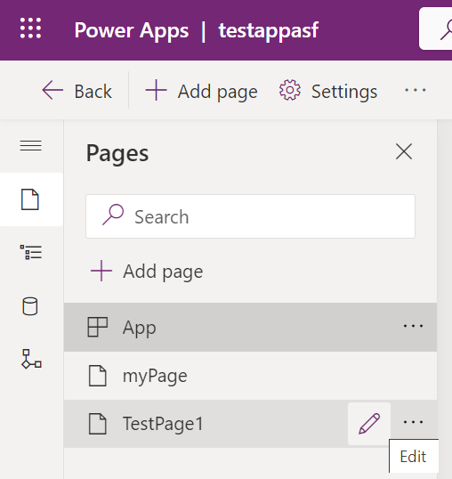

# 1. Introduction to Power Platform & App Scenario

Power Platform is the low code platform from Microsoft. If required also coding is possible e.g. by providing JavaScript. The Microsoft cloud service Azure is the foundation of the platform. This primer won't cover all aspects of the platform. It focuses at the aspects that are important for this hackathon.

# 2. Introduction to Power Platform

## Environment

Your home for this hackathon is your designated Power Platform environment. A PowerPlatform environment represents an environment such as development or production as you know it from software engineering. PowerPlatform distinguishes certain environment types (such as sandbox or production) that come with less or more functionality. An environment can be equipped with Dataverse or not. Your designated environment comes of course with dataverse since we will use Dataverse for persistency. In the Hackathon we don't work with a repository associated with the environment. 

Artefacts such as dataverse tables, apps etc. can either be directly created in an environment or created indirectly by importing a solution. Solutions are explained further down. In our case you will enhance artefacts that were imported into the environment.

## Web portal of Power Platform

The most important tool from the hackathon perspective is the web portal. It allows you to work with all relevant components for our hackathon such as the Dataverse, Power Apps and Solutions. The portal is scoped to a certain environment. The picture below shows a screenshot of the portal.

  

Comments regarding the picture:
* The red boxes in the picture mark environment and user

  You will get this information from us before the hackathon starts. It includes:
  * URL for environment: https://make.powerapps.com/environments/<your environment id>/home
  * User: Make sure you are always logged in with that user. The user IS NOT your capgemini EMail account.
  * User credentials: Use the password that is provided by us. 

* On the left hand side you have the main navigation that allows you to reach Dataverse, Power Apps and solutions.

## Dataverse

Dataverse is the built-in persistence mechanism for Power Platform. It is designed for transactional data. For analytic workloads Microsoft recommends switching to Azure. The core service is a SQL server but as you can see in the picture Dataverse is implemented behind the scene by a bunch of services.

  

The central element for storing data are tables. A table is just another entity in Power Platform as for instance a Power App. Columns, keys, views and relationships are comparable to the counterparts in relational databases. The following points summarize power platform and their relational database counterparts if existing:

* **Custom table:** Is a table that you define on top of the bult-in tables such as "account". For our hackathon we use only custom tables without reusing existing ones. In real world scenarios you would reuse the existing tables of the common data model to accelerate application development.
* **Predefined columns:** A newly created custom table comes with a lot of predefined columns. They are needed by the system but we won't use them for simplicity. Therefore you cannot create tables without them.
* **Primary Key:** Power Platform differentiates between the primary key that you name and an internal id (GUID). We will hit a scenario where we will need the internal GUID for referencing a record.
* **Keys:** Group multiple columns that must be unique. In a relational database you would use unique constraints.
* **Business Rules:** They allow to model constraints in general such as limiting values to a certain range. 
* **Autogenerated values:** In power platform you don't have separate sequence objects but you can specify the value as autogenerated according to a certain pattern.
* **Relationships:** They correspond to foreign key constraints in relational databases. Power platform uses partially a special terminology. An example are lookup columns that boil down to a relationship under the hood.
* **Choices:** You can think of them as an enum or a table with key value pairs. Relational databases don't provide something like that out of the box. You can limit a column to these values by associating the column with the choice as part of the column definition. Choices can't have an empty/null value.
* **Null values** Field values are stored as null when sending blank() or "". These blank values can be checked with IsBlank() in Power Apps and null in Power Automate Flows. Checking if a collection value is empty is done with IsEmpty() in Power Apps and empty in Power Automate Flows.
* **Owners** Each entry/row of a table is being owned by a user or team upon creation and is in relation to his business unit.

## Model-driven-Apps

Model driven apps are a special application type within power apps. Others are as stated previously out of scope. Model driven apps consist of a number of pages. Each page can use one of the three technologies which greatly differ from the developer experience:
1. Based on dataverse tables - [youtube video](https://youtu.be/LIC8DFW8fOE)
2. Custom Pages / canvas (Our focus)
3. Dashboards
4. Web resource
5. URL
These options are also reflected by the UI when you add a page:

  

This Hackathonis based on a Model-driven App, but we focus mainly on Custom pages. They can give you a citizen developer like experience. in that option you define the UI separatly on top of the dataverse tables in contrast to the dataverse table option. In the dataverse table option you define the UI for your tables within dataverse by forms. Therefore custom pages are much closer architecture principles such as separation of concerns.

The next major design decision within custom pages is using multiple screens within the same custom page or multiple custom pages. According to our experience from that hackathon custom pages come with serious limitations regarding communication with other pages:
* The `Navigate()` command only allows to pass a record to the called page

  This is for instance a problem if you want to pass additional infos beyond the record. Reading record information such as `id` on the target page is also done with `Param`.

* Including the parameters in the URL

  Custom pages have URL of the following format: `https://<orgname>.crm16.dynamics.com/main.aspx?appid=<app id>&pagetype=custom&name=<internal name of page>`. The expressions to use this are `Launch(URL)`. On the targeted custom page you can read the with `Param` (Sources: [URL Format](https://powerusers.microsoft.com/t5/Building-Power-Apps/Navigating-from-one-custom-page-to-another-with-parameters/td-p/1418875), [MS Docs](https://learn.microsoft.com/en-us/power-platform/power-fx/reference/function-param)).

  Although technically feasible it is not recommended for the following reasons:
  * Works only in final app and not in the testing environment when editing apps
  * No support for syntax check since URL is black box

Using multiple screens instead has the following advantages:
* More lightweight solution than multiple pages
* Arbitrary parameters possible with `Navigate()`
* Parameters can be passed as context that is scoped per screen

  Scoping means that the values are not visible outside the screen. Compared to global variables this greatly reduces side effects. This context is very close to parameters in function calls that you know from standard programming languages.

Editing custom pages is a two-steps process. First you switch the Model-driven-app in edit mode. Then you select the page to be edited.
The picture below illustrates the two levels starting from the portal:

  

The major controls to switch between the levels are:
* Portal => App in Edit Mode
 
  Select `Apps` in the main navigation of the portal or navigate to the app within the imported solution on the left hand side. Right-click on the app in question and select `Edit` in the context menu. To get back to the entry portal click the `Back` button in the top left corner.

* App => page in Edit Mode

  Hoovering over the page in question should already activate the pen icon. Click on that to edit the page. To get back to the app level click the `Back` button in the top left corner.
    

Saving is also a two step process if changes shall take effect outside your current scope. Current scope might be a concrete page or the application as a whole. Besides saving you also have to publish the changed artefact to take effect. For example first after publishing you see changes for a certain custom page also on model driven app level. The picture below shows the icons for saving (usual disk symbol) and publishing (the next icon to the right):

  

## Power Automate

Power automate is the workhorse to implement your business logic. It propagates a workflow like programming style that boils down to a graph. The trigger is the starting point, actions are represented by boxes and the arrows between the boxes determine what comes next. These triggers can be manual, scheduled or automated.Access to data sources or third party systems is provided by connectors that are used by the actions under the hood. The picture below shows a simple example of a few sequential steps:

  

Comments regarding the picture:
* Trigger of the flow is manual
* Arrows represent what comes next so in our case it is a pure sequential execution
* A box corresponds to a step within the flow performing a certain action

There are various types of flows but the major distinction for us is the following:
1. Stand alone flow (with a new UI Design) that is defined in Power Automate
2. Flow that is embedded in a Power App

   We will use the second option since option one would requires additional licenses. Embedded flows can only be called from Power Apps.

## Templates

Even though its recommendet to create a new project from scratch, especially for going into production, Microsoft does offer simple, pre-created examples named Templates to quickstart into Power Apps or Power Automate. They are easy to get into and edit, but most usecases are more advanced. You generally expand excisting solutions with new functionallity just like in this Hackathon.

## Solutions

The standard way to program in a low code platform is rather clicking instead of coding. That is fine for dev/ test environments. But think of production where clicking together is no option. You rather want to transfer what you clicked together as it is to production. That requires a programmatic way to export something from your dev/ test environment and import it to production.

The vehicle is a solution which can transport any artefact from power platform. A solution is a container on its own and you add the existing PowerPlatform artefacts to it after creation. Exporting a solution gives you a zip file. The reverse operation reinstates the objects you exported in the designated environment. We will use that mechanism to quickly provision your environment with the fully implemented data model and the partially implemented application.

# 3. Application Scenario

## Business Problem

Our application is centered around CO2 consumption data that is uploaded by the user. Once the upload is final it must be approved. First then it appears in the final destination table that holds the accumulated CO2 consumption per year. Importing consumption data consists of two parts:

* Import Header
  The header summarizes an import. It contains important general details for import and approval such as user and timestamps. The state of the import controls the overall business process. The following values are possible:
  
  * Pending - Import has been done but the figures are not ready for approval
  * Finalized - Figures are ready for approval
  * Approved - Figures have been approved and can be processed
  * Processed - Figures have been added to the accumulated CO2 consumption by the system.

  Changes of the import state trigger the next step in the business flow. E.g. setting the state to `Finalized` allows to trigger the approval. Business rules enforce consistency e.g. an approving user must be stored if the state is approved.

* Import data

  Each record in the table denotes a CO2 consumption. Driver refers to the substance that caused the CO2 emission.

## Application Functionality

Our application knows two types of users:

* Users that are eligible for import (all employees that are not part of the COMPLIANCE department)
* Users that are eligible for approval (all employees that are part of the COMPLIANCE department)

The application will internally track the user type by a sign in process that we already implemented for you.

The application provides importing users a search mask as entry point. It contains the list of imports with the possibility to filter. The screenshots below are not the final ones from the programmed application (e.g. a more professional look and feel is missing). They are conceptual ones that shall just better explain which functionality is provided per screen:

  

It allows the user to either

* Start a new import

  This is optin is always enabled. No matter how many records where filtered.

* Editing an existing one

  That option requires selecting a single record in the list

Major mechanism to manage the import is a wizard. The context of the wizard is either (1) the import to be edited or (2) none if a new import shall be created. The wizard consists of three steps:
* Create/ Update import header

  The functionality of that step is only available if the state of the header is `Pending`. Otherwise the screen is read only. In that step the importer creates or updates the header. For simplicity reasons the changes (new or edit) will be written directly to the dataverse when submit is clicked. The screenshot below shows the conceptual screen:
    

* Upload Import Data

  The functionality of that step is only available if the state of the header is `Pending`. Otherwise the screen is read only. In that step the importer uploads the local file containing the consumption data.
  The upload will always refer to an existing import. Either because you are editing an existing import or because you are editing the newly created one. The screenshot below shows the conceptual screen:
    

* Trigger approval

  The functionality of that step is only available if the state of the header is `Pending`. Otherwise the screen is read only. This step triggers the state change by pressing the button to `Finalized`. The screenshot below shows the conceptual screen:
    

The approving user also gets a search mask as entry point that is geared towards finalized imports that have not been approved yet. Approval is done by filtering the relevant records and clicking the approve button. Additionally the approver can display the accumulated CO2 consumptions per year.

  
  

Our application does not provide functionality to maintain users and their corresponding departments. The idea is to use the built-in dataverse functionality to modify the data if required.

Custom pages are used to bundle the functionality for the importer and approver since both are independent from the workflow. Depending on the department only the relevant page is shown. All functionality within a page is implemented by using multiple screens.

## Data Model

The picture below shows the conceptual data model. The table names are abbreviated. As stated previously only the red marked tables are covered by the application:

  

The meaning of the tables are as follows. The names are the ones that are also used in dataverse:
* IMP_CO2_CONS_ACC - Aggregated CO2 consumption
* IMP_CO2_CONS_RAW_HDR - Import header
* IMP_CO2_CONS_RAW - Consumption data of the import
* IMP_USERS - Users and associated department
* Table IMP_DEARTMENTS - Departments
* IMP_STATES_CHOICE - Possible import states
* IMP_CO2_DRIVER_TYPES_CHOICE - Possible drivers for CO2 emission

Conceptually all tables below behave like tables. But from PowerPlatform perspective we have technically two kinds of tables: **(1) custom tables** and **(2) choice**. Choice is like an enum and from a tabular perspective they have just two columns to accomodate key value pairs. They are the preferred option when you have a rather fixed set of values.

The table below gives a short overview of the columns for the custom tables. In our hackathon the only used default column feature is attachments. All other required ones we defined manually. In a real world scenario you would only define missing columns on top of the existing ones. All relevant columns except attachments have the prefx `CST` to quickly identify them:

|Table name          |Column name           |Purpose                                     |
|--------------------|----------------------|--------------------------------------------|
|IMP_CO2_CONS_ACC    |CST_ACC_CODE          |Logical primary Key of table                |
|IMP_CO2_CONS_ACC    |CST_CO2_CONS_YEAR_TONS|Accumulated CO2 emission per year in tons   |
|IMP_CO2_CONS_ACC    |CST_CO2_DRIVER        |Substance causing CO2 emission              |
|IMP_CO2_CONS_ACC    |CST_DEP_CODE          |Year of CO2 consumption                     |
|IMP_CO2_CONS_RAW_HDR|CST_IMP_CODE          |Logical primary Key of table                |
|IMP_CO2_CONS_RAW_HDR|CST_IMP_STATE         |Overall state of import                     |
|IMP_CO2_CONS_RAW_HDR|CST_IMP_TS            |Timestamp of import creation                |
|IMP_CO2_CONS_RAW_HDR|CST_IMP_USERNAME      |User name of importing user                 |
|IMP_CO2_CONS_RAW_HDR|CST_IMP_YEAR          |Year of CO2 emission                        |
|IMP_CO2_CONS_RAW_HDR|CST_IMP_DESC          |Additional import description               |
|IMP_CO2_CONS_RAW_HDR|CST_APPR_TS           |Timestamp of approval                       |
|IMP_CO2_CONS_RAW_HDR|CST_APPR_USERNAME     |Name of approving user                      |
|IMP_CO2_CONS_RAW_HDR|Attachment            |Uploaded data                               |
|IMP_CO2_CONS_RAW    |CST_IMP_ITM_CODE      |Logical primary Key of table                |
|IMP_CO2_CONS_RAW    |CST_IMP_CODE          |Reference to import header                  |
|IMP_CO2_CONS_RAW    |CST_CO2_CONS_YEAR_TONS|CO2 consumption caused by the department    |
|IMP_CO2_CONS_RAW    |CST_CO2_DRIVER        |Substance causing CO2 emission              |
|IMP_CO2_CONS_RAW    |CST_DEP_CODE          |Department causing the CO2 emission         |
|IMP_DEPARTMENTS     |CST_DEP_CODE          |Code of the department and logical primary key|
|IMP_DEPARTMENTS     |CST_DEP_NAME          |Name of the department                      |
|IMP_USER            |CST_USERNAME          |Logical primary Key of table                |
|IMP_USER            |CST_EMAIL             |EMAIL of user                               |
|IMP_USER            |CST_DEP_CODE          |Department code of user                     |

