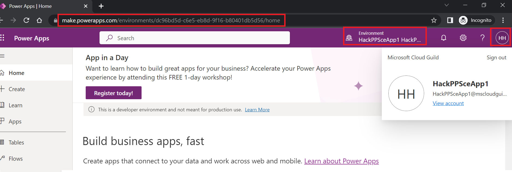

# 1. Introduction to Power Platform & App Scenario

Power Platform is the low code platform from Microsoft. If required also coding is possible e.g. by providing JavaScript. The Microsoft cloud service Azure is the foundation of the platform. This primer won't cover all aspects of the platform. It focuses at the aspects that are important for this hackathon.

# 2. Introduction to Power Platform
## Web portal of Power Platform

The most important tool from the hackathon perspective is the web portal. It allows you to work with all relevant components for our hackathon such as the Dataverse, Power Apps and solutions. The portal is scoped to a certain environment. A PowerPlatform environment represents an environment such as dev or prod as you know it from software engineering. PowerPlatform environment types are for instance sandbox or production. The picture below shows a screenshot of the portal.

  

Cooments regarding the picture:
* The red boxes in the picture mark the environment and the user.
* On the left hand side you have the main navigation that allows you to reach Dataverse, Power Apps and solutions.
* Make sure you are always LOGGED IN with the user we provide in the hackathon and not with your Capgemini EMail account

## Dataverse

Dataverse is the built-in persistence mechanism for Power Platform. It is designed for transactional data. For analytic worloads Microsoft recommends switching to Azure. The core service is a SQL server but as you can see in the picture Dataverse is a implemented behind the sceen by a bunch of services.

  

The central element for storing data are tables. A table is just another entity in Power Platform as for instance a Power App. Columns, keys, views and relationships are compareable to the counterparts in relational databses. The following points summarize power platform and their relational database counterparts if existing:

* **Custom table:** Is a table that you define on top on the existing ones defined by the system such as "account". For our hackathon we use only custom tables without reusing existing ones.
* **Predefined columns:** A newly created custom table comes with a lot of predefined columns. They are needed by the system but we won't use them for simplicity.
* **Primary Key:** Power Platform differentiates between the primary key that you name and an internal id (GUID). We will hit a scenario where we will need the internal GUID for referencing a record.
* **Keys:** Group multiple columns that must be unique. In a relational database you would use unique constraints.
* **Business Rules:** They allow to model constraints in general such as limiting vaues to a certain range. 
* **Autogenerated values:** In power platform you don't have separate sequence objects but you can specify the value as autogenerated according to a certain pattern.
* **Relationships:** They correspond to foreign key constraints in relational databases. Power platform uses partially a special terminology. An example are lookup columns that boil down to a relationship under the hood.
* **Choices:** You can think of them as an enum or a table with key value pairs. Relational databases don't provide something like that out of the box. You can limit a column to these values by associating the column with the choice as part of the column definition.

## Model-driven-Apps

Model driven apps are a special application type within power apps. Others are as stated previously out of scope. Model driven apps consist of a number of pages. Each page can use one of the three technologies which greatly differ from the developer experience:
1. Based on dataverse tables
2. Custom Pages (Our focus)
3. Dashboards
These three options are also reflected by the main choice you have to make when adding a page:

  

Custom pages can give you a citizen developer like experience. Compared to the dataverse table option they are closer to architecture principles for professional developers since the UI is not directly bound to the tables. Only power pages provide licenses that are for a bunch of users.

A major design decision is also whether you use multiple screens within the same custom page or multiple custom pages. According to our experience from that hackathon custom pages come with a serious limitation regarding communication with other pages:
* Navigate() command only allows to pass a record to the called page

  This is for instance a problem if you want to pass additional infos beyond the record. Reading record information such as `id` on the target page is also done with `Param`.

* Including the parameters in the URL is also not recommended

  Custom pages have URL of the following format: `https://<orgname>.crm16.dynamics.com/main.aspx?appid=<app id>&pagetype=custom&name=<internal name of page>`. The expressions to use this are `Launch(URL)`. On the targeted custom page you can read the with `Param` (Sources: [URL Format](https://powerusers.microsoft.com/t5/Building-Power-Apps/Navigating-from-one-custom-page-to-another-with-parameters/td-p/1418875), [MS Docs](https://learn.microsoft.com/en-us/power-platform/power-fx/reference/function-param)).

  Although technically feasible it is not recommended for the following reasons:
  * Works only in final app and not in the emedded testing app
  * No check support since url is black box

Using multiple screens instead has the following advantages:
* More leightweight solution than multiple pages
* Arbitrary parameters possible with `Navigate()`
* Parameters can be passed as Context that is scoped per screen

  Scoping means that the values are not visible outside the screen. Compared to global variables this greatly reduces side effects. This context is very close to parameters in function calls that you know from standard programming languages.

Editing custom pages is a two step process. First you switch the Model-driven-app in edit mode. Then you select the page to be edited as shown below:

  

Changing something is also a two step process. Changes must be saved AND published to take effect. For example first after publishing you see changes for a certain custom page also on model driven app level. The picture below shows the icons for svaing and publishing:

  

## Power Automate

Power automate propagates a workflow like business logic programming style that boils down to a graph. The trigger is the starting point, actions are represented by boxes and the lines between the boxes determine what comes next. Access to data sources or third party systems is provided by connectors that are used by the actions under the hood. The picture below shows a simple example of a few sequential steps:

  

Comments regarding the picture:
* Trigger of the flow is manual
* Arrows represent what comes next so in our case it is a pure seuqnetial execution
* A box corresponds to a step within the flow performing a certain action

There are various types of flows but the major distinction for us is the following:
1. Stand alone flow that is defined in Power Automate
2. Flow that is embedded in a Power App
We will use the second option since option one requires higher licenses.

## Solutions

The standard way to program in a low code platform is rather clicking instead of coding. That is fine for dev/ test environments. But think of production as environment. There clicking together is no option. You rather want to transfer what you clicked together as it is to production. That requires a programmatic way to export something from your dev/ test environment and import it to production.

The vehicle is a solution which can transport any artefact from power platform. You can click it together in the portal or by exporting it. Exporting a solution gives you a zip file. The reverse operation reinstates the objects you exported in the designated environment. We will use that mechanism to quickly provision your environment with th fully implemented data model and the partially implemented application.

# 3. Application Scenario

## Business Problem

Our application is centeredaround CO2 consumption data that is uploaded by the user. Once the upload is final it must be approved. First then it appears in the final destination table that holds the accumulated CO2 consumption per year. Importing consumption data consists of two parts:
* Import Header

  The header summarizes an import. It contains important general importing and approving details such as user and timestamps. Business rules enforce consistency e.g. an approving user must be stored if the state is approved. One tracks the current state of the import which has the following state model:
  
  * Pending - Import has been done but the figures are not ready for approval
  * Finalized - Figures are ready for approval
  * Approved - Figures habe been approved and can be processed
  * Processed - Figures have been added to the accumated CO2 consumption by the system.

  Changes of the import state trigger the next step in the business flow. E.g. setting the state to `Finalized` allows to trigger the approval.

* Import data

  Each record in the table denotes a CO2 consumption. Driver refers to the substance that caused the CO2 emission.

## Application Functionality

Our application knows two types of users:
* Users that are eligible for import (all employees that are not part of the COMPLIANCE department)
* Users that are eligible for approval (all employees that are  part of the COMPLIANCE department)
The application will internally track the user type by a sign in process that we already implemented for you.

The application provides importing users a search mask as entry point. It contains the list of imports with the possibility to filter. The screenshots below are not the final ones from the programmed application (e.g. a more professional look and feel is missing). They are conceptual ones that shall just better explain which functionality is provided per screen:

  

It allows the user to either
* Start a new import

  This is optin is always enabled. No matter whether how many records where filtered.

* Editing an existing one

  That option requires selecting a single record in the list. Moreover the import state must not yet be finalized.

Major mechanism to manage the import is a wizard. The context of the wizard is either (1) the import to be edited or (2) none if a new import shall be created. The wizard consists of three steps:
* Create/ Update

  The functionality of that step is only available if the state of the header is not yet `Finalized` or higher. In that step the importer creates or updates the header depending on the wizard context. For simplicity reasons the changes (new or edit) will be written directly to the dataverse when submit is clicked. The screenshot below shows the conceptual screen:
    

* Upload

  The functionality of that step is only available if the state of the header is not yet `Finalized` or higher. In that step the importer uploads the local file containing the consumption data.
  The upload will always refer to an existing import. Either the header import from the wizard context is edited or the newly created one. The screenshot below shows the conceptual screen:
    

* Approve

  The functionality of that step is only available if the state of the header is not yet `Finalized` or higher. This step signals to the approver that the import is ready for approval. Signaling is triggered by clicking the button which sets the state of the import header to `Finalized`. The screenshot below shows the conceptual screen:
    

The approving user also gets a search mask as entry point that is geared towards finalized imports that have not been approved yet. Approval is done by filtering the relevant records and clicking the approve button. Additionally the approver can display the accumulated CO2 consumptions per year.

  
  

Our application does not provide functionality to maintain users and their corresponding departments. The idea is to use the built-in dataverse functionality to modify the data if required.

Custom pages are used to bundle the functionality for the importer and approver since both are independent from the workflow. Depending on the department only the relevant page is shown. All functionality within a page is implemented by using multiple screens.

## Data Model

The picture below shows the data model (Table names are abbreviated):

  

The meaning of the tables are as follows. The names are the ones that are also used in dataverse:
* IMP_CO2_CONS_ACC - Aggregated C=2 consumption
* IMP_CO2_CONS_RAW_HDR - Import
* IMP_CO2_CONS_RAW - Consumption data
* IMP_USERS - Users and associated department
* IMP_DEARTMENTS - Departments
* IMP_STATES_CHOICE - Eligible import states
* IMP_CO2_DRIVER_TYPES_CHOICE - Drivers for CO2 emission

## Working with tables

The following points are relevant for the later hackathon:
* Edit tables to enter data manually
* Understanding of the column definition of the table IMP_CO2_CONS_RAW_HDR

To edit table data you just have to click on the table name. You can use the filter in the top right corner to limit the displayed tables.
  

The lower part shows now a grid where you can directly edit the values.
  

Specifics resulting from the column definition are automatically reflected by the grid. That means:
* You cannot directly edit the primary key since it is defined as autogenerated
* You can only select as user names that are entered in the table CST_USERS
* You can only select a value from the predefined state values

To understand the columns checkout the column definitions. Click on "Columns" as shown below.

  

Select the column you are interested in. You can limit the columns by filtering according to the prefix "CST". The screenshot below shows the definition of the column that references a choice.
  
