# 1. Introduction to Import Implemented Artefacts

Due to time we cannot create the data model step by step nor can we implement the complete application. We will use **solutions** instead as transport mechanism to deploy a fully implemented database model and the partially implemented application as starting point. This approach can be used for any artefact that has been created within PowerPlatform.  Essentially solutions boil down to a Zip file that contains the artefacts in an internal Microsoft format that you should always treat as black box.

A solution can either be `managed`or `unmanaged`, which differ regarding the possibility to edit and the lifecycle. Only the `unmanaged` solution gives you the possibility to edit the imported artefacts. Artefacts inside the solution are not automatically removed, when you remove the solution. `managed` don't allow editing and a removal also removes also all containing artefacts. Therefore `managed` is intended for a production deployment scenario whereas `unmanaged` for development scenarios.

We will use both types:
* Data model: `managed` since we already implemented everything
* Partially implemented application `unmanaged` so that you can fill the gaps

When performing an import you have to distinguish two scenarios:
* Importing partially implemented application => main focus of the hackathon
* Importing fully implemented application => only if you want to see the fully implemented code

# 2. Import Implemented Artefacts

# Data Model

Perform the following steps:
1. Download the file `DbTables_managed.zip` from [our code repo](https://github.com/DevOps-Gilde/Hackathon_PP_ModelDrivenApp_CstPages_Code) in the **main branch**

2. Switch to "Solutions" in the main menu
 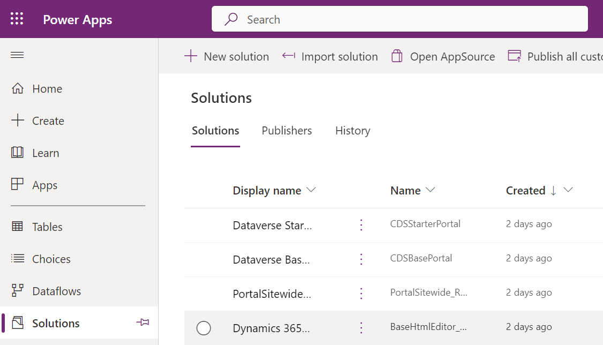 

3. Click on "import solution" and select the downloaded file from the repo and click next.
 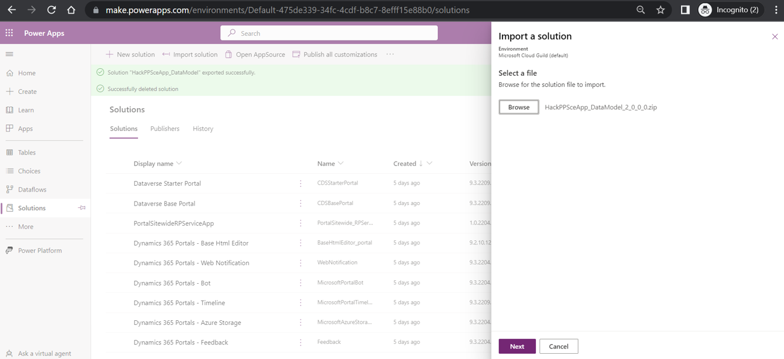 

4. Start the import by clicking the button import as shown below
 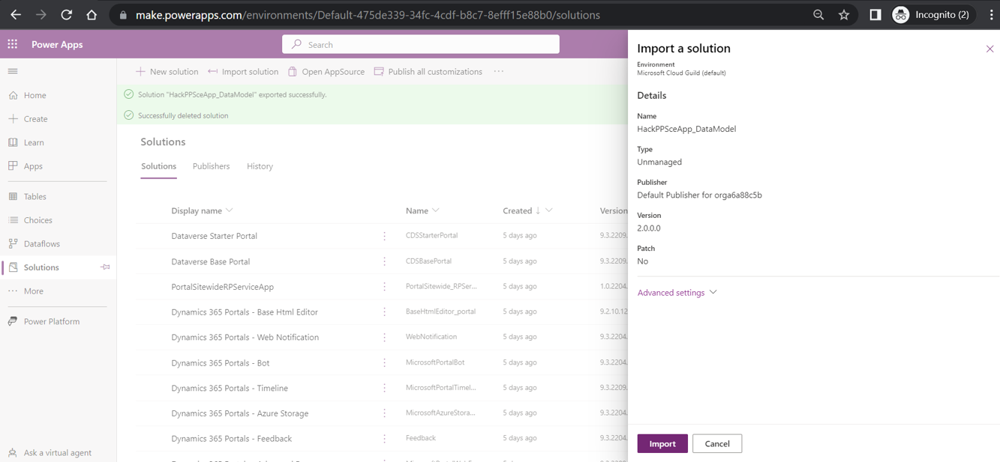 

5. Wait until the portal shows at the top the message "Solution successfully imported"
 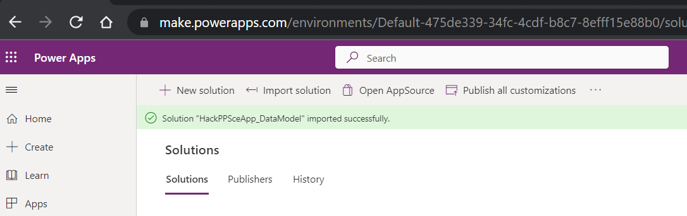 

6. Check success by example

   Go to the `solution` in the main menu and open it by clicking edit as shown below:
    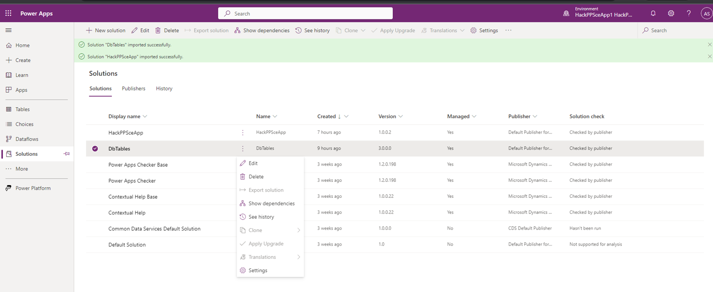 

   As a result you should see now the custom tables/ choices we need for our application that all start with the prefix "IMP" as sown below:
    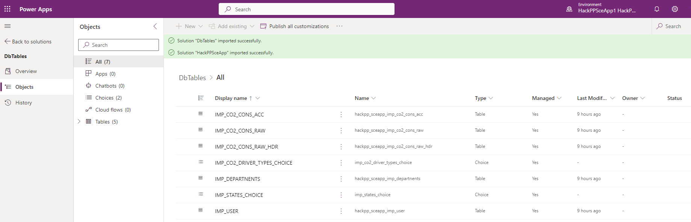 

   The custom tables don't contain any rows. To work with our application you must enter some data since our application soes not cover all tables. Enter data for the tables IMP_USERS and IMP_DEPARTMENT via the dataverse. Right click on the table and choose the option `Edit`.

# Partially implemented model driven app

Perform the following steps to impart the app:
1. Download the file `HackPPSceApp_unmanaged.zip` from [our code repo](https://github.com/DevOps-Gilde/Hackathon_PP_ModelDrivenApp_CstPages_Code) in the **main branch**

2. Switch to "Solutions" in the main menu
  

3. Click on "import solution" and select the downloaded file from the repo and click next.
  

4. Start the import by clicking the button import as shown below

   Under the hood the flow dataverse maintains a connection to dataverse. This is specific for the environment. Therefore you have to map the connection from the imported solution to one in your environment. If you start from scratch you would have to select `+ New connection`. Click on `+ New connection`to create a new connection as shown below:

    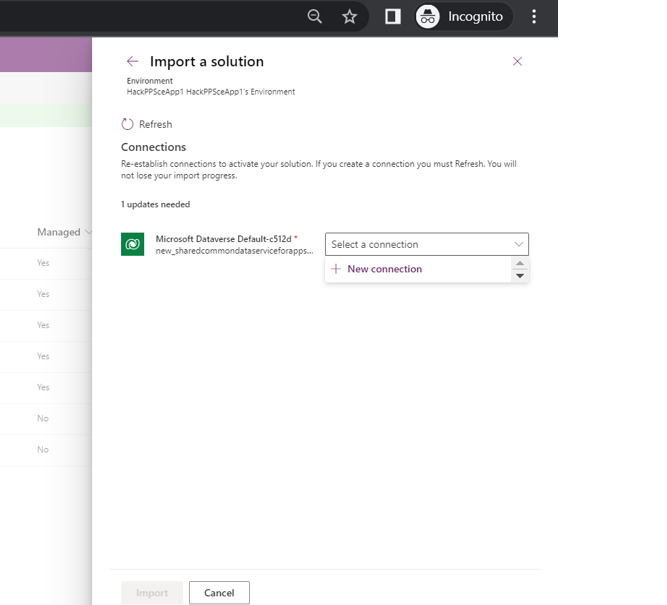 

   The upcoming screens guide through the creation. Confirm by clicking `Create`and enter your user including credentials. 

    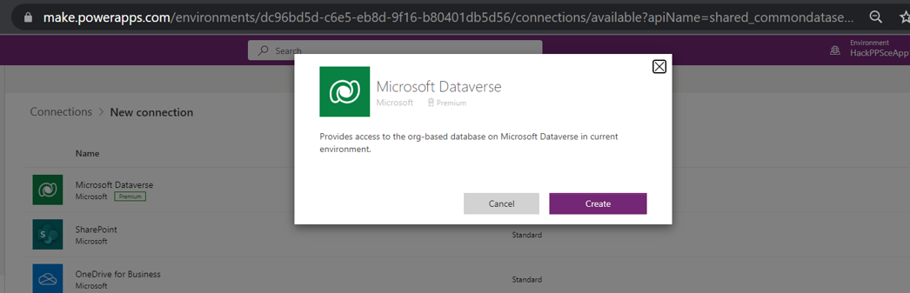 
    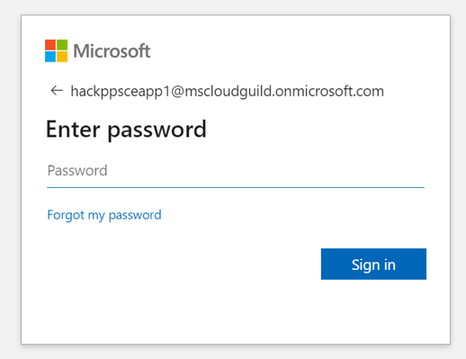 
    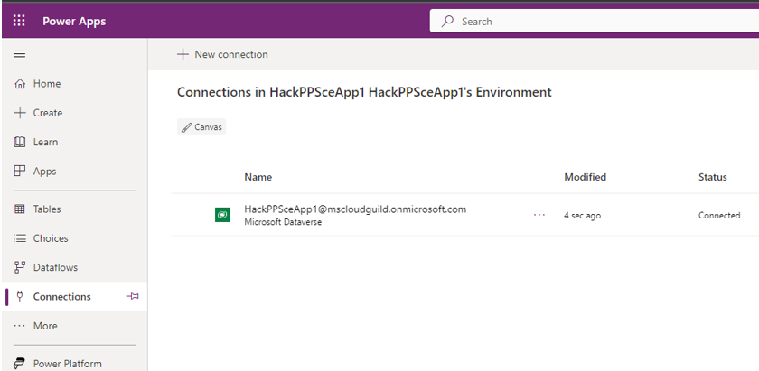 

   Finally you would rerun the import and select the previously created one.
    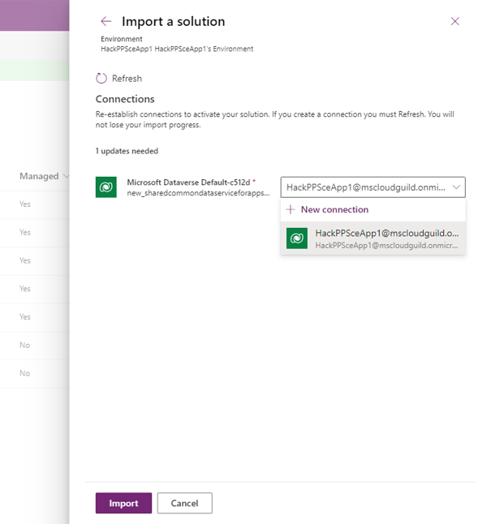 

5. Wait until the portal shows at the top the message "Solution successfully imported"
  

6. Prepare for editing the app

   Go to the solution and open the model driven app in edit mode. You will see a screen that requests republishing the application as shown below.
   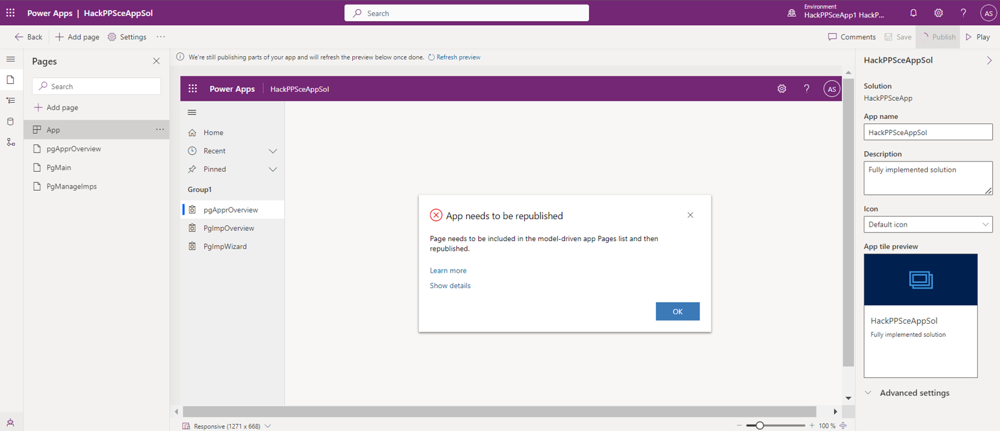 
  
   Clicking the publish button should fix the problem. Now you can start editing the pages as stated in the upcoming tasks.

# Fully implemented model driven app

:warning: **Note:** The import overwrites your work => do it only at the end :warning:

The major differences to the partially implemented app:
* File you have to import: Use `HackPPSceApp_unmanaged.zip` from [our code repo](https://github.com/DevOps-Gilde/Hackathon_PP_ModelDrivenApp_CstPages_Code) in the **Solution branch**
* Importing: Reuse the connection you created previously instead of creating a new one
