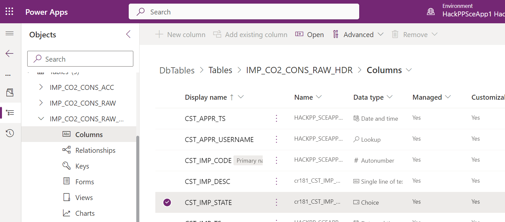

# 1. Introduction to Import Implemented Artefacts

Due to time we cannot create the data model step by step nor can we implement the complete application. We will use instead a transport mechanism to deploy a fully implemented database model and the partially implemented application as starting point. This approach can be used for any artefact that has been created within PowerPlatform. Microsoft calls deployable code packages also `Solutions`. Essentially they boil down to a Zip file that contains the artefacts in an internal Microsoft format that you should always treat as black box.

# 3. Importing Prerequisites

Perform the following steps:
1. Download the file `Solution_DbTables_Hackathon_managed_2_0_0_0.zip` from [our code repo](https://github.com/DevOps-Gilde/Hackathon_PP_ModelDrivenApp_CstPages_Code) 

2. Switch to "Solutions" in the main menu
  

3. Click on "import solution" and select the downloaded file from the repo and click next.
  

4. Start the import by clicking the button import as shown below
  

5. Wait until the portal shows at the top the message "Solution successfully imported"
  

6. Check success by example

   As a result you should see now the custom tables we need for our application that all start with the prefix "IMP" as sown below:
     

Repeat the same steps with the zip file `Solution_App_Hackathon_managed_2_0_0_0.zip` to import the partially implemented application.

# 4. Working with tables

The following points are relevant for the later hackathon:
* Edit tables to enter data manually
* Understanding of the column definition of the table IMP_CO2_CONS_RAW_HDR

To edit table data you just have to click on the table name. You can use the filter in the top right corner to limit the displayed tables.
  

The lower part shows now a grid where you can directly edit the values.
  

Specifics resulting from the column definition are automatically reflected by the grid. That means:
* You cannot directly edit the primary key since it is defined as autogenerated
* You can only select as user names that are entered in the table CST_USERS
* You can only select a value from the predefined state values

To understand the columns checkout the column definitions. Click on "Columns" as shown below.

  

Select the column you are interested in. You can limit the columns by filtering according to the prefix "CST". The screenshot below shows the definition of the column that references a choice.
  

