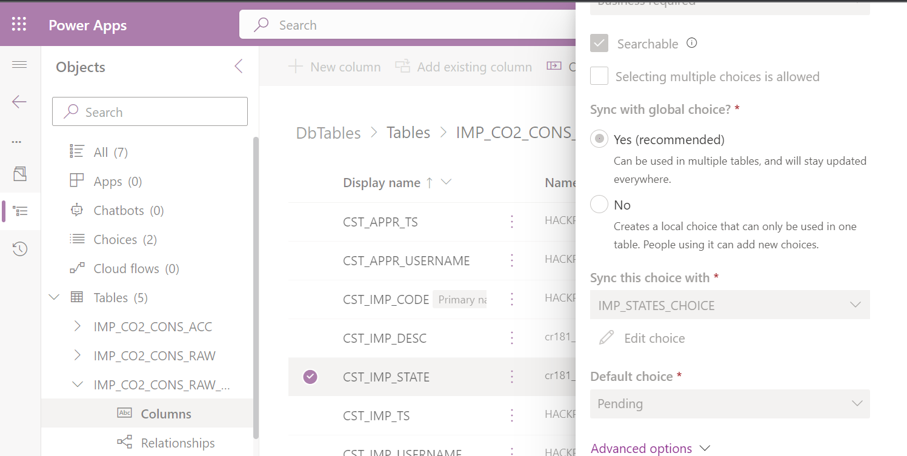

# 1. Introduction to Import Implemented Artefacts

Due to time we cannot create the data model step by step nor can we implement the complete application. We will use **solutions** instead as transport mechanism to deploy a fully implemented database model and the partially implemented application as starting point. This approach can be used for any artefact that has been created within PowerPlatform.  Essentially solutions boil down to a Zip file that contains the artefacts in an internal Microsoft format that you should always treat as black box.

A solution can either be `managed`or `unmanaged` Both options differ regarding the possibility to edit the artefacts definition and their lifecycle. Only the `unmanaged` solution gives you the possibility to edit the imported artefacts. Artefacts inside the solution are not automatically removed, when you remove the solution. A `managed` solution doesn't allow editing and all containing artefacts are removed with the solution. Therefore `managed` is intended for a production deployment scenario whereas `unmanaged` for a development scenarios.

We will use both types:
* Data model: `managed` solution since we already implemented everything
* Partially implemented application: `unmanaged` solution so that you can fill the gaps

When performing an import you have to distinguish two scenarios:
* Importing partially implemented application => main focus of the hackathon
* Importing fully implemented application => only if you want to see the fully implemented code

# 2. Import Implemented Artefacts

# Data Model

Perform the following steps:
1. Download the file `DbTables_managed.zip` from [our code repo](https://github.com/DevOps-Gilde/Hackathon_PP_ModelDrivenApp_CstPages_Code) in the **main branch**

2. Switch to `Solutions` in the main menu
  

3. Click on `import solution` and select the downloaded file from the repo and click next.
  

4. Start the import by clicking the button import as shown below
  

5. Wait until the portal shows at the top the message `Solution successfully imported`
  

6. Check success

   We will jump right into working with dataverse tables to check success. The custom tables don't contain any rows. To work with our application you must enter some data in the tables IMP_USERS and IMP_DEPARTMENT since our application does not cover all tables. Understanding the column definitions of the table IMP_CO2_CONS_RAW_HDR is also beneficial.

   Navigate in the main menu to `Solutions` and click on the imported `DbTables`. as shown in the screenshot:
     

   To enter data you just have to click on the table name in question. Make sure the category `All` or `tables` is selected as in the screenshot below:
     

    The lower part shows now a grid where you can directly edit the values.
      

    Specifics resulting from the column definition are automatically reflected by the grid. That means:
    * You cannot directly edit the primary key since it is defined as autogenerated
    * You can only select as user names that are entered in the table CST_USERS
    * You can only select a value from the predefined state values

    To understand the columns checkout the column definitions. Click on `Columns` as shown below.
      

    Select the column you are interested in. You can limit the columns by filtering according to the prefix "CST". The screenshot below shows the definition of the column that references a choice.
      

# Partially implemented model driven app

Perform the following steps to import the app:
1. Download the file `HackPPSceApp_unmanaged.zip` from [our code repo](https://github.com/DevOps-Gilde/Hackathon_PP_ModelDrivenApp_CstPages_Code) in the **main branch**

2. Switch to `Solutions` in the main menu
  

3. Click on `import solution` and select the downloaded file from the repo and click next.
  

4. Specify dataverse connection

   Under the hood the flow maintains a connection to dataverse. This is specific for the environment. Therefore you have to map the connection from the imported solution to a connection in your environment. If you start from scratch you would have to select `+ New connection`. Click on `+ New connection`to create a new connection as shown below:

     

   The upcoming screens guide through the creation. Confirm by clicking `Create`and enter your user including credentials. 

     
     
     

   Finally you would rerun the import and select the previously created connection.
     

5. Wait until the portal shows at the top the message "Solution successfully imported"
  

6. Prepare for editing the app

   Go to the solution and open the model driven app in edit mode. You will see a screen that requests republishing the application as shown below.
    
  
   Clicking the publish button should fix the problem. Now you can start editing the pages as stated in the upcoming tasks.

# Fully implemented model driven app

:warning: **Note:** The import overwrites your work => do it only at the end :warning:

The major differences to the partially implemented app:
* File you have to import: Use `HackPPSceApp_unmanaged.zip` from [our code repo](https://github.com/DevOps-Gilde/Hackathon_PP_ModelDrivenApp_CstPages_Code) in the **Solution branch**
* Importing: Reuse the connection you created previously instead of creating a new one
