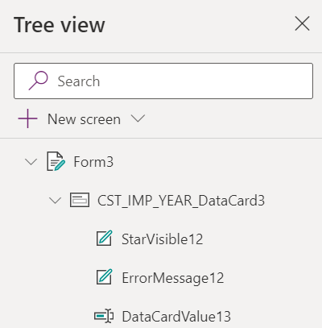

# 1. Introduction to Wizard

You should now have Completed the Following things:

1. Importing Implemented Artefacts

Next you add the required controls to the first step of the wizard and wire it with the rest of the application.

# 2. Implementation Task

## Introduction

Each step of the wizard is implemented as a separate screen within the same custom page. In the default the ability to create multiple screens is disabled. The screenshot below shows the setting if you want to create your own application:

  

In that step you will implement the first half of the first step of the wizard which enables the user to edit or create a new import. In the first half you will create the main content page. 

  

After having completed everything the application will display an information message when you click the submit button.

The learning goals are as stated before:
* Layouting controls
* Working with the form control (New Mode)
* Expressions for navigation

## Layouting Form and Button

As you know it from other environments our application shall support responsive layout so we will avoid pixel based statements. A key are containers that allow to layout their child components based on relative a measurement such as a percentage. Container layout their children either horizontally or vertically and can be nested. We already implemented the first container for you that uses the expressions `Parent.Width`and `Parent.Height` to occupy all space of the screen. The screenshot below shows the starting point. As you can see theer is a gap in the sense that the main content is missing:

  

Let's now implement the content for which we need an additional container (to block the bulk of the screen) and the child controls (Form and button). We will start with the vertical container for the content. Adding controls always follows the same pattern which is as follows:
* Select the parent control `WizardLayout_Create` on the canvas
* Pick the control from the list `+Insert`

  This will add the new container to the end of the children list. That is not what we want, since it must be placed between header and footer.

* Reorder newly added container

  You have to click on the context menu (...) dots of the control in the tree view. There you find the option to move it as shown below:
    

* Adjust properties

  First we have to make sure that container fills the bulk of the screen. The screenshot belows shows the relevant settings:
    
  Adjust the following peoperties as follows:
  * Activate flexible height if not already done
  * Set the first figure of `Fill posrtions' to `0.8`which corresonds to 80 percent of the space
  * make sure that the `Alignment in container` is as shown

* Rename the newly added control to `Content_Create`

Insert the remaining controls according in the same way and name them accordingly:

|Control   |Name Parent   |Name  |
|---|---|---|
|EditForm   |Content_Create   |up to you   |
|Button   |Content_Create   |up to you  |

## Configure Form and Button

In this step of the wizard we either create or update the header of an existing import. We will use a form to achieve that combined with a button that is triggering create or edit. As a first intermediate step the button will first display the values of the form in an alert window.

To add the form as child control select the newly added container. Pick the control `EditForm` in the same way as you did the container. All further explanation refer to the newly added form. 

First we have to wire our form with the underlying IMP_CO2_CONS_RAW_HDR table. Go to the data source property and select the table.

  

Next we have to pick all relevant columns. Click on `Edit fields` and select all custom columns that start with `CST`. Select them as indicated in the screenshot.

  

Creating or editing is defined by the property mode. The value depends in our case of the context that was passed when the first step was called. That is the first case where we need a formula to determine the correct value. That is not possible using the predefined values at the right-hand side. We have to use formular bar that is similar to excel as shown below:

  

To enter any formular for a given property do the following:
* select the name of the property on the left-hand side (here DefaultMode)
* set the expression on the right hand side after the Fx icon

  The expression in our case is a simple if expression: `If(TODOVarMode, FormMode.New, FormMode.Edit)`. The tested expression refers to the context wizard. The setting of the value for `TODOVarMode` we alraedy implemented for you when you click the buttons on the overview page. 

For the mode `New` we have completed all major fields. However in case of edit the control has no idea which record we want to edit. The control provides the Item property we want to edit (In the mode New the value is ignored). Set the expression as follows: `TODOSelectedItem`. The setting of the value for `TODOSelectedItem` we alraedy implemented for you when you click the buttons on the overview page. 

As a last step we set the relative height so that the form occupies minimum space. Set `Fill portions` to `0.2`.

We are fnished and can switch over to the button. Select the newly added container again. Pick the control `Button` in the same way as you did the 

Change the Text property to `Submit`. The property `OnSelect` contains the action when the button is pressed. For now we will just display an information that proofs we can access the values in the form. Enter the following expression in the "OnSelect" property: `Notify(<name of the value below the card within the form>, NotificationType.Information)`. The name can be obtained by the tree view as shown below:

  

## Navigation

As you have already seen there are a lot of different artefacts like screens and pages that need to be linked. Our page is not yet correctly wired.

Both buttons `Previous`and `Home` at the footer still need to be configured.
TODO What are the expressions

Switch to the custom page TODO. There the `OnSelect` property of the buttons `New`and `Edit` needs still to be implemented. In that case we have to achieve two things: (1) jump to the first screen within the wizard and (2) set the context accordingly.
TODO What are the expressions

# 3. Testing changes

Testing changes is quite easy trough the `Play` button that is provided by the web portal as shown below:

  

Don't forget to save and publish your changes before testing. You have to run the application in the right scope. That means:
* Local changes within a custom page

  Just press the play button to start the custom page. The crseenshot below shows an example. Use the `X` button at the right top corner to switch back into edit mode.
  TODO screenshot

* Changes that span Custom Changes

  Make first sure you switch back to the model driven app. Press the `Back` button at the top of the screen to switch to the App. Just press the play button to start the custom page. The screenshot below shows an example. Use the `X` button at the right top corner to switch back into edit mode.
  TODO screenshot

A full test will require to test on app level due to the cross navigation.