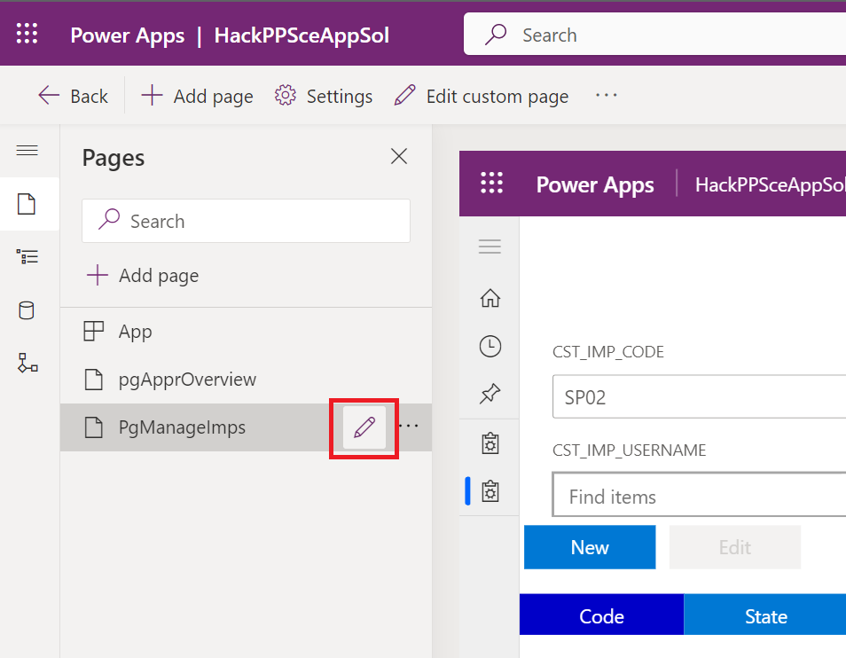
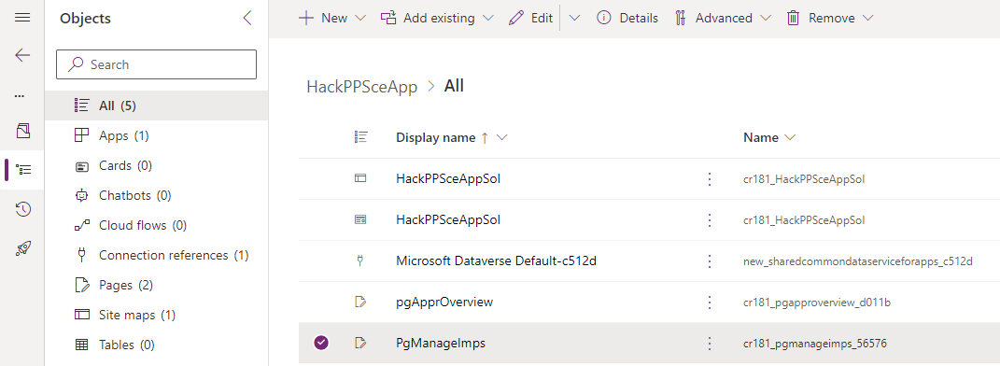
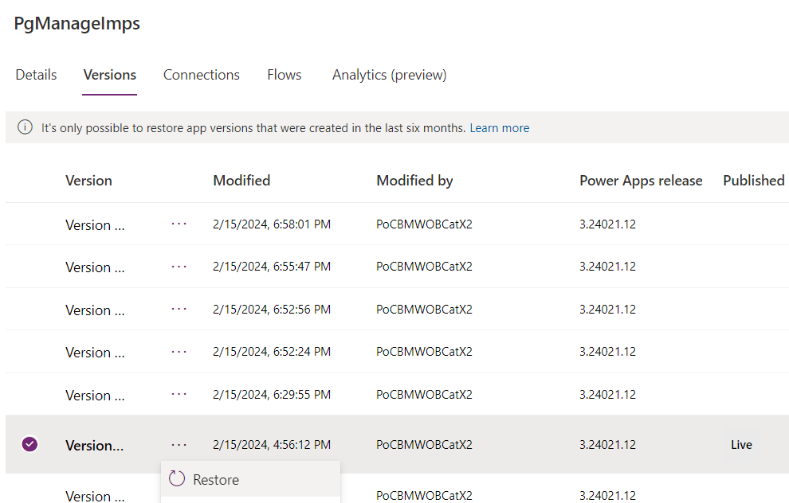
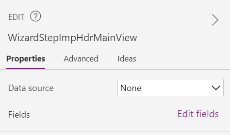
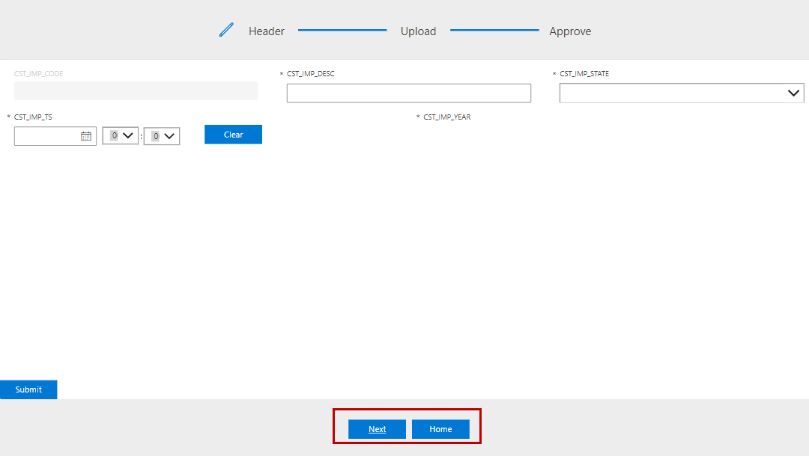
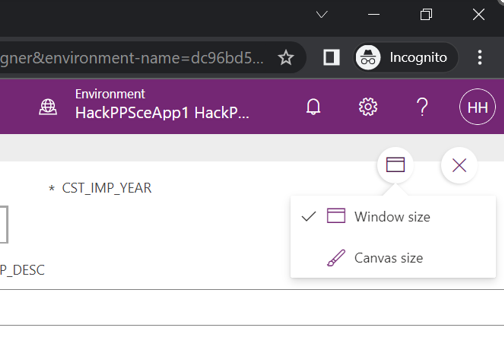

# 1. Introduction to Wizard

You should now have completed the following things:

1. Importing implemented artefacts

Next you add the required controls for the first step of the wizard and wire them with the rest of the application.

# 2. Goal

Each step of the wizard is implemented as a separate screen within the same custom page. In the default setup the ability to create multiple screens is disabled. We enabled this setting already for you. The screenshot below shows where the setting can be found:

<br><br>

The screenshot below shows the starting point. As you can see the main content of the first header step is missing. Moreover no action is implemented when you click the home or next button.

<br><br>

The screenshot below shows the result if you have completed all implementation tasks.

<br><br>

This includes
* Form and Submit button
* display an information message when you click the submit button
* navigating to correct screen when you click next or home button

# 3. Implementation Tasks
## Add controls for main content

Navigate to the page for approvals named `PgManageImps` within the app as shown in the screenshot below and click the edit icon:
<br><br>

You will notice that this page is again split into multiple screens on the left side, which can fill the whole or only parts of the page:
- OvrImports
- WizardStepImpHeader
- WizardStepUploadData
- WizardStepAppr

Click through them to see the whole page changing. We can use later use `Navigate()` Buttons to travel between them with a selected amount of local variables instead of using global ones. For now we will focus on WizardStepImpHeader.

As you know it from other environments our application shall support responsive layout so we will avoid pixel based statements. A key are containers that allow to layout their child components based on relative a measurement such as a percentage. Container layout their children either horizontally or vertically and can be nested. We already implemented the first container for you that uses the expressions `Parent.Width` and `Parent.Height` to occupy all space of the screen. The screenshot below shows the starting point. As you can see there is a gap in the sense that the main content is missing:
<br><br>

To implement the content we need first an additional container. We it to group the form and the submit button. They are comparable to a `div`element in HTML. We will start with the vertical container for the content. Adding controls always follows the same pattern which is as follows:
* Select the parent control `WizardStepImpHdrLayout` on the canvas or in the tree on the left-hand side
* Add the control `Vertical container` from the list under `+Insert`

  If you don't see the control in the list you have to look under `Layout`. The newly added container will be added to the end of the children list. That is not what we want, since it must be placed between header and footer.

* Reorder newly added container

  Click on the context menu (...) of the container control in the tree view. There you find the option `Move up` to move it as shown below:
  <br><br>
  You can also use `Ctrl+]` and `Ctrl+[` on keyboard layouts that don't need ALT for the brackets. [Other shortcuts can be found here](https://learn.microsoft.com/en-us/power-apps/maker/canvas-apps/keyboard-shortcuts)

* Adjust properties

  First we have to make sure that container fills the bulk of the screen. The screenshot below shows the relevant settings on the right-hand side:
  <br><br>
  Adjust the following properties as follows:
  * Activate flexible height if not already done
  * Set the first figure of `Fill portions` to `0.8` which corresonds to 80 percent of the space
  * make sure that the `Alignment in container` is as shown

  We won't need the container anymore later so the name is up to you.

Select the newly added container so that it is going to become the new parent for insert. Insert the remaining controls in the same way and order. 

The form will be referenced later in code snippets. Rename the newly added form to `WizardStepImpHdrMainView` to ensure the code snippets work. The newly added button won't be referenced so the name is up to you.

## Saving and Versioning
You have done the first changes! Congratulations! You shall better save them now. Click the disk icon or hit `[ctrl+S]` on your keyboard now.
<br><br>

Well done! This state is saved as a new version in your version history. Not to be confused with the version of the app/solution. You can also publish this version with the button next to the disk to the right, or using `[ctrl+shift+P]`.

We are going to test rolling back to an older version in case you brake something and can't undo the changes.
Therefor you are going do click onto the new form `WizardStepImpHdrMainView` and add a `Rectangle`, which will add a very noticeable blue box onto your screen. Now you are going to save this version without publishing it with the disk symbol again.

Lets imagine this rectangle was totally unwanted and you can't revert it or it broke some of your work.
On the top, far left, above the `Tree View`and under the colored title `Power Apps  |  PgManageImps (Editing)` is an arrow with the text `Back`.
Use it once to go back to the `all pages` level.
<br><br>

Use it again to go back to the objects of your solution:
<br><br>

Here you can see the 3 pages pgApprOvetview, PgMain and PgManagelmps which saved your changes. Our rectangle should be found in the page `PgManagelmps`. Click on the `...` button next to its name and open the `Details` view. Next to the details you should find the tab for Versions where the version on the top is the latest iteration with the rectangle and the version with the `Published` lable `Live` should be an earlier version without the rectangle.
<br><br>

Again you can just hit the `...` button to `Restore` a version. Do so for the version you published `Live` before. It will create a copy of that version as a newer version. Afterwards you can reload the project and the rectangle should be gone. Please check if your other changes are still in this version and redo them if not.

## Understanding Dataverse

Before we work with the Form you should make yourself familiar with Dataverse.
Open the Data Menu on the left side and click on the `...` next to the `IMP_CO2_CONS_RAW_HDR` table to go to the minimalistic `Edit data` view. 
<br><br>

Here you can expand your view by clicking on `+24 more` and adding the column `CST_IMP_USERNAME`.
You can view each column settings by clicking on the titles and on `Edit column`, but as you can see the managed Table prevents you from editing the entries under CST_IMP_CODE and Created On columns, but you could edit the field under the column `CST_IMP_USERNAME`. In this case it is not working though, because it is no text field, but a lookup field. You can only select entries from a different table. Currently there is no entry inside to select and we are going to change that.

Open a new browser tab at [https://make.powerapps.com/](https://make.powerapps.com/) and go to `Tables`, filter `All` and click on `IMP_USER`.
<br><br>

This opens the bigger Table view where you can also inspect the Schema of the columns for their important schema and logical name and much more. At the bottom you see the column `CST_USERNAME` which is not the primary key of the entry, but the user-friendly "primary name column". To fill this entry simply write any text under it. Other fields will automatically set default values like the current date in the other column.
<br><br>

After doing so you can go back to the prior `IMP_CO2_CONS_RAW_HDR` table and under the lookup column `CST_IMP_USERNAME` the option for your new username should be selectable.

You do not need to save this change and can close the view by discarding all changes.

## Configure added Form

First we have to wire our form with the underlying `IMP_CO2_CONS_RAW_HDR` table. Go to the `Data source` property and select the table.
<br><br>

Next we have to pick all relevant columns. Click on `Edit fields`. You see then the already selected columns.
<br><br>

Remove the column `Created On` by hovering over the entry. In the appearing context menu (...) on the right hand side you find an option to delete it. Select now all missing columns that start with `CST_IMP` by clicking on `+ Add field` as shown below:
<br><br>

As a reaction you will now see additional input cards. Each card covers one column. Each card consists of multiple controls. We will need them later. Therefore naming and a better understanding of the control structure is important. The screenshot belows shows the description card:
<br><br>

The important take aways:
* A card contains multiple controls
* Control holding the user input => here `DataCardValue3`
* Other controls that contain other visual parts such as column label, asteriks etc.

Rename the controls **HOLDING THE USER INPUT** listed below as stated since we need them later:
|Card               |Technical Control Type| Rename To|
|-------------------|-----------------------------------|-----|
|Importing user name|ComboBox                          | WizardStepImpHdrMainViewImportUserNameDropDown|
|Year               |TextInput                         |                            WizardStepImpHdrMainViewImportYearTextBox|
|Description        |TextBox                           |WizardStepImpHdrMainViewImportDescTextBox|

Creating or editing is defined by the property `Default mode`. The new and the edit scenario require different values. That is the first case where we need a formula to determine the correct value. Two ways exist:
* Entering it in the properties on the right-hand side
* Formular bar

  The screen below shows it:
  <br><br>

  To enter any formular for a given property do the following:
  * select the name of the property on the left-hand side (here DefaultMode)
  * set the expression on the right hand side after the Fx icon

  You can drag the bottom formular bar border downwards or click the arrow on the right side of it to expand it.

  Overwrite the existing value with the following simple if expression: 
  
  `If(locImpMode = "Edit", FormMode.Edit, FormMode.New)`
  
  Explanations regarding the expression:
  * `locImpMode` is the local variable that contains the mode.
  * The setting of the value for `locImpMode` we already implemented for you when you click the buttons on the overview page. 

For the mode `New` we have completed all major fields. Edit requires additional information about the record to edit. The control provides the `Item` property on the tab `Advanced` for that purpose (In the mode New the value is ignored). Set the expression as follows:
```
LookUp(
  IMP_CO2_CONS_RAW_HDR, 
  CST_IMP_CODE = locImpCode)
```

Explanations regarding the expression:
* `IMP_CO2_CONS_RAW_HDR` denotes the table we are looking at
* `LookUp` retrieves the record that fulfills the condition
* `CST_IMP_CODE = locImpCode` represents the condition that filters the currently edited record

Many fields within the cards are configured with defaults such as the card for the import code. With the standard configuration the field is still displayed as editable but you cannot jump into it. To avoid confusion we want to disable it for creating a new record. It also a good example to illustrate that you have to sometimes unlock properties before being able to edit them. To unlock them click on the lock icon:
<br><br>

Unlock the property `DisplayMode` on the tab `Properties` for the cards CST_IMP_CODE, CST_IMP_STATE and CST_IMP_TS. Overwrite the existing value with the following expression:
`If(locImpMode = "New", DisplayMode.Disabled, Parent.DisplayMode)`

Explanations regarding the expression:
* `DisplayMode.Disabled` disables the card
* `Parent.DisplayMode` enforces the default behavior

Furthermore we want to fill the description with additional derived data, which could even be stored as a new variable. Select the Card `WizardStepImpHdrMainViewImportDesc` and replace the `Default` propety with `myDescription`. This will lead to a temporary error, since the variable is not getting initialized yet.

As a last step we set the relative height so that the form occupies minimum space. Set `Fill portions` on the tab `Properties` to `0.2`.

## Configure added Submit Button

We are finished and can switch over to the button. Change the `Text` property on the tab `Properties` to `Submit`. The property `OnSelect` contains the action when the button is pressed. For now we will just display an information that proofs we can access the values in the form. Enter the following expression in the `OnSelect` property on the tab `Advanced`:

```
UpdateContext({
  myDescription: WizardStepImpHdrMainViewImportDescTextBox.Value & " This element needs a checkup on: " & Text( DateAdd( Now(), 7 ), "dd-mm-yyyy at hh:mm" )});

Notify(
  "Changes submitted for import " & WizardStepImpHdrMainViewImportDescTextBox.Value & " submitted. " & myDescription, 
  NotificationType.Information)
```

Explanations regarding the expression:
* `UpdateContext` will fill the myDescription variable with derived or even calculated data. Since the form card selects the new myDescription, it could directly insert it into our database
* `&` is the operator for concatenating strings
* `Notify` displays a message of the given type

## Navigation

As you have already seen we work with screens to separate things. They are linked and the first step of our wizard is not yet correctly wired. Both buttons `Next` and `Home` at the footer still need to be configured.

<br><br>

`Next` means we just refer to the screen representing the second step in our wizard. In addition to that we have to pass required context information. This context information includes:
* The primary key of the newly created/ edited record
* The import state of the newly created/ edited record

The `Navigate` command allows to jump to the designated screen and to pass local parameters. This is important as we don't want to use global variables! Set the `OnSelect` property of the button to the following expression:

```
Navigate(
  WizardStepUploadData, 
  ScreenTransition.None, 
  { 
    locImpState: locImpState, 
    locImpCode: locImpCode})
```

Explanations regarding the expression:
* `{}` is an arbitrary json structure that we use to pass the information
* `WizardStepUploadData` is the name of new screen and we just pass the current values of the local variables.

The `Home` button shall reference the entry page for the importer. Passing any parameters is not required. Therefore just set the `OnSelect` of the button to `Navigate(OvrImports, ScreenTransition.None, {})`. Local variables will be correctly adjusted because in the overview page because we implemented the `OnVisible` property of the overview screen.
  
# 4. Testing changes

For testing you have the following options. For our case quicktests are sufficient. The second option is only given as information:
* Quicktests

  Ad hoc test of changes is quite easy trough the `Play` button (Triangle icon) that is provided by the web portal as shown by the first screenshot. The current screen selected in the tree view is assumed as screen under test. 
  <br><br>
  
  An important setting is the icon besides the `X`. When you click on it choose the option `Canvas size` as shown below. The screen is then rendered as in the designer.
<br><br>

  To finish the test mode click the `X` as shown in the screenshot below:
  <br><br>

  A problem of that approach is the setting of the context. In our case you can achieve it by starting with the importing overview screen. In a more complex case with many test cases this might mean a lot of clicking.

* Test Studio

  It allows you to define test cases that consist of steps. Each step can have an action such as `Navigate()`. Running these tests greatly reduces clicking. The two screenshots below shall give you only an idea:
  <br><br>
  <br><br>

* Running application

  In rare edge cases this is the last feedback due to observed problems in the Quicktests environment. 

Press the play button after selecting the import overview screen to start the quicktests. Thanks to your changes the following scenarios should now work:
|Test                                             |Expected Result                          |
|-------------------------------------------------|------------------------------------------|
|Import Overview Screen: Click on new import button |Fields on the form are empty. Clicking on the submit button should show an additional info message with the entered description.|
|Import Overview Screen: Filter down to a single record and click on the edit import button|Fields on the form are prefilled with the record you selected. Clicking on the submit button should show an additional info message with the entered description.|
|Wizard first step: Click on next button          |Next screen is displayed                  |
|Wizard first step: Click on home button          |Overview page is shown from where wizard was triggered (Correct display of list only when you run the app)|
