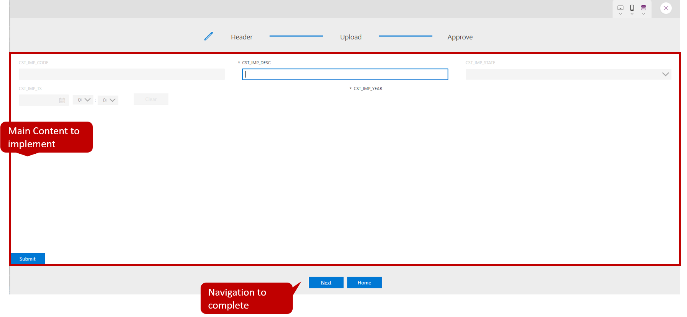

# 1. Introduction to Wizard

You should now have Completed the Following things:

1. Importing Implemented Artefacts

Next you add the required controls to the first step of the wizard and wire it with the rest of the application.

# 2. Implementation Task

## Introduction

Each step of the wizard is implemented as a separate screen within the same custom page. In the default the ability to create multiple screens is disabled. The screenshot below shows the setting if you want to create your own application:

  

In that step you will implement the first half of the first step of the wizard which enables the user to edit or create a new import. In the first half you will create the main content page. 

  

After having completed everything the application will display an information message when you click the submit button.

The learning goals are as stated before:
* Layouting controls
* Working with the form control (New Mode)
* Expressions for navigation

## Layouting Form and Button

As you know it from other environments our application shall support responsive layout so we will avoid pixel based statements. A key are containers that allow to layout their child components based on relative a measurement such as a percentage. Container layout their children either horizontally or vertically and can be nested. We already implemented the first container for you that uses the expressions `Parent.Width` and `Parent.Height` to occupy all space of the screen. The screenshot below shows the starting point. As you can see there is a gap in the sense that the main content is missing:

  

Let's now implement the content for which we need an additional container (to block the bulk of the screen) and the child controls (Form and button). We will start with the vertical container for the content. Adding controls always follows the same pattern which is as follows:
* Select the parent control `WizardLayout_Create` on the canvas
* Pick the control from the list `+Insert`

  This will add the new container to the end of the children list. That is not what we want, since it must be placed between header and footer.

* Reorder newly added container

  You have to click on the context menu (...) dots of the control in the tree view. There you find the option to move it as shown below:
    

* Adjust properties

  First we have to make sure that container fills the bulk of the screen. The screenshot below shows the relevant settings:
    
  Adjust the following properties as follows:
  * Activate flexible height if not already done
  * Set the first figure of `Fill positions' to `0.8`which corresonds to 80 percent of the space
  * make sure that the `Alignment in container` is as shown

* Rename the newly added control to `Content_Create`

Insert the remaining controls according in the same way and name them accordingly:

|Control   |Name Parent   |Name  |
|---|---|---|
|EditForm   |Content_Create   |up to you   |
|Button   |Content_Create   |up to you  |

## Configure Form and Button

In this step of the wizard we either create or update the header of an existing import. We will use a form to achieve that combined with a button that is triggering create or edit. As a first intermediate step the button will first display the values of the form in an alert window.

To add the form as child control select the newly added container. Pick the control `EditForm` in the same way as you did the container. All further explanation refer to the newly added form. 

First we have to wire our form with the underlying `IMP_CO2_CONS_RAW_HDR` table. Go to the data source property and select the table.

  

Next we have to pick all relevant columns. Click on `Edit fields` and select all custom columns that start with `CST`. Select them as indicated in the screenshot.

  

Creating or editing is defined by the property mode. The value depends in our case of the context that was passed when the first step was called. That is the first case where we need a formula to determine the correct value. That is not possible using the predefined values at the right-hand side. We have to use formular bar that is similar to excel as shown below:

  

To enter any formular for a given property do the following:
* select the name of the property on the left-hand side (here DefaultMode)
* set the expression on the right hand side in the formula Field after the fx Symbol 

  The expression in our case is a simple if expression: `If(TODOVarMode, FormMode.New, FormMode.Edit)`. The tested expression refers to the context wizard. The setting of the value for `TODOVarMode` we already implemented for you when you click the buttons on the overview page. 

For the mode `New` we have completed all major fields. However in case of edit the control has no idea which record we want to edit. The control provides the Item property we want to edit (In the mode New the value is ignored). Set the expression as follows: `TODOSelectedItem`. The setting of the value for `TODOSelectedItem` we already implemented for you when you click the buttons on the overview page. 

As a last step we set the relative height so that the form occupies minimum space. Set `Fill portions` to `0.2`.

We are finished and can switch over to the button. Select the newly added container again. Pick the control `Button` in the same way as you did the 

Change the Text property to `Submit`. The property `OnSelect` contains the action when the button is pressed. For now we will just display an information that proofs we can access the values in the form. Enter the following expression in the "OnSelect" property: `Notify(<name of the value below the card within the form>, NotificationType.Information)`. The name can be obtained by the tree view as shown below:

  

## Navigation

As you have already seen we work with screens to separate things. They are linked and the first step of our wizard is not yet correctly wired. Both buttons `Next` and `Home` at the footer still need to be configured.

`Next`means we just refer to the screen representing the second step in our wizard. In addition to that we have to pass required context information for the next step. This context information includes:
* The primary key of the newly created/ edited record
* The import state of the newly created/ edited record
The `Navigate` command allows to jump to the designated screen and to pass parameters. Set the `OnSelect` propery of the button to `Navigate(<name of screen>, ScreenTransition.None, {TODO})`. `{}` is an arbitrary json structure that we use to pass the information. The property names can be used as they are in the referenced page.

The `Home` button shall reference the entry page for the importer. Passing any parameters is not required. Therefore just set the `OnSelect` of the button to `Navigate(TODO)`.
  
# 3. Testing changes

For the testing options below your changes must be at least saved. For testing there are two options:
* Quicktests

  Ad hoc test of changes is quite easy trough the `Play` button that is provided by the web portal as shown by the first screenshot. The current screen selected in the tree view is assumed as screen under test. 
    
  
  An important setting is the icon besides the `X`. When you click on it choose the option `Canvas size` as shown below. The rendering is then shown as in the designer.
  

  To finish the test mode click the `X` as shown in the second screenshot below:
    

  A problem of that approach is the setting of the context. In our case you can achieve it by starting with the importing overview screen. In a more complex case with many test cases this might mean a lot of clicking.

* Test Studio

  It allows you to define test cases that consist of steps. Each step can have an action such as `Navigate()`. Running these tests greatly reduces clicking. The two screenshots below shall give you only an idea:
    
    
  
For our case ad-hoc testing is sufficient. Start from the import overview page to ensure a correct screen context. Press the play button after selecting the overview screen to start the tests. Thanks to your changes the following scenarios should now work:
|Test                                             |Expected Result                          |
|-------------------------------------------------|------------------------------------------|
|Wizard first step: Run wizard first step |Main content should displayed correctly               |
|Wizard first step: Click on next button          |Next screen is displayed                  |
|Wizard first step: Click on home button          |Overview page is shown from where wizard was triggered|
|Import Overview Page: Click on new import button |Fields on the form are empty|
|Import Overview Page: Select a single record and click on edit import button|Fields on the form are prefilled with the record you selected|
