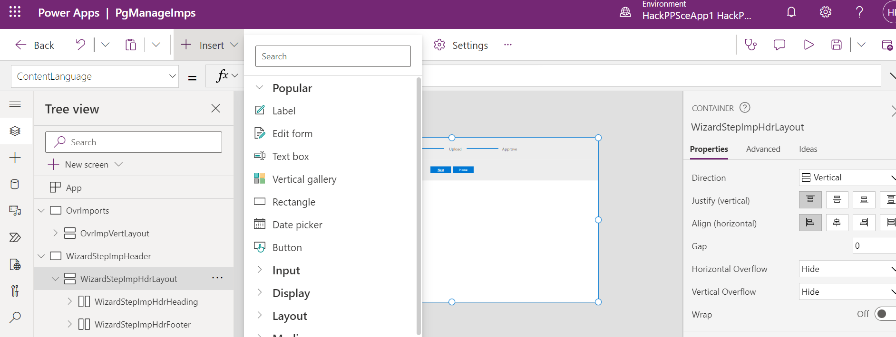
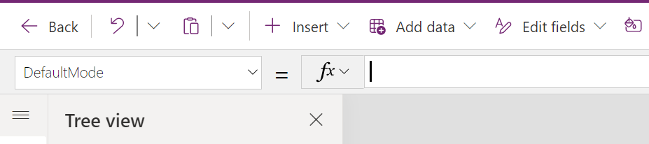

# 1. Introduction to Wizard

You should now have Completed the Following things:

1. Importing Implemented Artefacts

Next you add the required controls for the first step of the wizard and wire them with the rest of the application.

# 2. Implementation Task

## Introduction

Each step of the wizard is implemented as a separate screen within the same custom page. In the default setup the ability to create multiple screens is disabled. The screenshot below shows the setting in case you want to create your own application:

  

Focus of part 1 will be the main content of the first step of the wizard including the navigation as shown below:

  

After having completed everything the application will display an information message when you click the submit button.

The learning goals are as stated before:
* Layouting controls
* Working with the form control (New/ Edit Mode)
* Expressions for navigation

## Layouting Form and Button

As you know it from other environments our application shall support responsive layout so we will avoid pixel based statements. A key are containers that allow to layout their child components based on relative a measurement such as a percentage. Container layout their children either horizontally or vertically and can be nested. We already implemented the first container for you that uses the expressions `Parent.Width` and `Parent.Height` to occupy all space of the screen. The screenshot below shows the starting point. As you can see theer is a gap in the sense that the main content is missing:

  

Let's now implement the content for which we need an additional container (to block the bulk of the screen) and the child controls (EditForm and Button). We will start with the vertical container for the content. Adding controls always follows the same pattern which is as follows:
* Select the parent control `WizardStepImpHdrLayout` on the canvas or in the tree on the left-hand side
* Add the control `Vertical container` from the list under `+Insert`

  If you don't see the control in the list you have to look under `Layout`. The newly added container will be added to the end of the children list. That is not what we want, since it must be placed between header and footer.

* Reorder newly added container

  You have to click on the context menu (...) dots of the control in the tree view. There you find the option `Move up` to move it as shown below:
    

* Adjust properties

  First we have to make sure that container fills the bulk of the screen. The screenshot below shows the relevant settings on the right-hand side:
    
  Adjust the following properties as follows:
  * Activate flexible height if not already done
  * Set the first figure of `Fill portions` to `0.8` which corresonds to 80 percent of the space
  * make sure that the `Alignment in container` is as shown

  We won't need the container anymore later so the name is up to you.

Insert the remaining controls in the same way and order. The form will be referenced later in code snippets. Therefore the name must be as stated below:

|Control   |Name Parent   |Name  |
|---|---|---|
|EditForm   |newy added `Container1`    |WizardStepImpHdrMainView   |
|Button   |newy added `Container1`   |up to you  |

## Configure Added Form and Button

First we have to wire our form with the underlying `IMP_CO2_CONS_RAW_HDR` table. Go to the data source property and select the table.

  

Next we have to pick all relevant columns. Click on `Edit fields`. You see then the already selected columns.

  

Remove the column `Created On` by hovering over the entry. In the appearing context menu (...) on the right hand side you find an option to delete it. Select now all missing columns that start with `CST_IMP` by clicking on `+ Add field` as shown below:

  

As a reaction you will now see additional input card per column. Each card consists of multiple controls. We will need them later. Therefore naming and a better understanding of the control structure is important. The screenshot belows shwos the description card:

  

The important take aways:
* A card contains of multiple controls
* Control holding the user input => here `DataCardValue3`
* Other controls that contain other visual parts such as column label, asteriks etc.

Since we need the user input later for the database rename the control with the user input as follows:
|Card               |Technical Control Type| Name|
|-------------------|-----------------------------------|-----|
|Importing user name|ComboBox                          | WizardStepImpHdrMainViewImportUserNameDropDown|
|Year               |TextInput                         |                            WizardStepImpHdrMainViewImportYearTextBox|
|Description        |TextBox                           |WizardStepImpHdrMainViewImportDescTextBox|

Creating or editing is defined by the property mode. The value depends in our case of the context that was passed when the first step was called. That is the first case where we need a formula to determine the correct value. Two ways exist:
* Entering it in the properties on the right-hand side
* Formular bar

  The screen below shows it:

    

  To enter any formular for a given property do the following:
  * select the name of the property on the left-hand side (here DefaultMode)
  * set the expression on the right hand side after the Fx icon

  The expression in our case is a simple if expression: `If(locImpMode = "Edit", FormMode.Edit, FormMode.New)`. `locImpMode` is the local variable that contains the mode. The setting of the value for `locImpMode` we already implemented for you when you click the buttons on the overview page. 

For the mode `New` we have completed all major fields. However in case of edit the control has no idea which record we want to edit. The control provides the Item property we want to edit (In the mode New the value is ignored). Set the expression as follows: `LookUp(IMP_CO2_CONS_RAW_HDR, CST_IMP_CODE = locImpCode)`. Explanations:
* `IMP_CO2_CONS_RAW_HDR` denotes the table we are looking at
* `LookUp` retrieves the record the fulfills the condition
* `CST_IMP_CODE = locImpCode`represents the condition that filters the currently edited record

Some of the fields within the form are set internally for a new record. Therefore we want to disable them for new to make it more clear. Sometimes properties are locked as shown in the screenshot below. To unlock them click on the lock icon:

  

Click on the lock and adjust the property `DisplayMode` for CST_IMP_CODE, CST_IMP_STATE and CST_IMP_USER. The required expression is `If(locImpMode = "New", DisplayMode.Disabled, Parent.DisplayMode)`. 

As a last step we set the relative height so that the form occupies minimum space. Set `Fill portions` to `0.2`.

We are finished and can switch over to the button. Select the newly added container again. Pick the control `Button` in the same way as you did before.

Change the Text property to `Submit`. The property `OnSelect` contains the action when the button is pressed. For now we will just display an information that proofs we can access the values in the form. Enter the following expression in the "OnSelect" property: `Notify("Changes submitted.", NotificationType.Information)`.

## Navigation

As you have already seen we work with screens to separate things. They are linked and the first step of our wizard is not yet correctly wired. Both buttons `Next` and `Home` at the footer still need to be configured.

  

`Next` means we just refer to the screen representing the second step in our wizard. In addition to that we have to pass required context information for the next step. This context information includes:
* The primary key of the newly created/ edited record
* The import state of the newly created/ edited record
The `Navigate` command allows to jump to the designated screen and to pass parameters. Set the `OnSelect` property of the button to `Navigate(WizardStepUploadData, ScreenTransition.None, { locImpState: locImpState, locImpCode: locImpCode})`. `{}` is an arbitrary json structure that we use to pass the information. `WizardStepUploadData` is the name of new screen and we just pass the current values of the local variables.

The `Home` button shall reference the entry page for the importer. Passing any parameters is not required. Therefore just set the `OnSelect` of the button to `Navigate(OvrImports, ScreenTransition.None, {})`. Local variables will be correctly adjusted because in the overview page because we implemented the `OnVisible` property of the overview screen.
  
# 3. Testing changes

For testing you have the following options:
* Quicktests

  Ad hoc test of changes is quite easy trough the `Play` button that is provided by the web portal as shown by the first screenshot. The current screen selected in the tree view is assumed as screen under test. 
    
  
  An important setting is the icon besides the `X`. When you click on it choose the option `Canvas size` as shown below. The rendering is then shown as in the designer.
  

  To finish the test mode click the `X` as shown in the second screenshot below:
    

  A problem of that approach is the setting of the context. In our case you can achieve it by starting with the importing overview screen. In a more complex case with many test cases this might mean a lot of clicking.

* Test Studio

  It allows you to define test cases that consist of steps. Each step can have an action such as `Navigate()`. Running these tests greatly reduces clicking. The two screenshots below shall give you only an idea:
    
    

* Running application

  In rare edge cases this i sthe last feedback due to observed problems in the Quicktests environment. 
   
For our case ad-hoc testing is sufficient. Start from the import overview page to ensure a correct screen context. Press the play button after selecting the overview screen to start the tests. Thanks to your changes the following scenarios should now work:
|Test                                             |Expected Result                          |
|-------------------------------------------------|------------------------------------------|
|Wizard first step: Run wizard first step |Main content should displayed correctly               |
|Wizard first step: Click on next button          |Next screen is displayed                  |
|Wizard first step: Click on home button          |Overview page is shown from where wizard was triggered (Correct display of list only when you run the app)|
|Import Overview Page: Click on new import button |Fields on the form are empty|
|Import Overview Page: Select a single record and click on edit import button|Fields on the form are prefilled with the record you selected|
