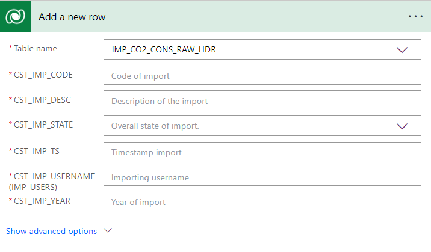

# 1. Introduction to Flows

You should now have Completed the Following things:

1. Importing database
2. Implement Wizard Step 1 (Part1)

Next you will complete the implementation of the first step of the wizard.

# 2. Implementation Task

## Introduction

We will now replace the alert window with code to persist the changes in the database. We will use a different approach depending on the scenario: (1) for edit we will use the standard SubmitForm command and for (2) New we will implement an embedded flow.

The reason for the embedded flow is a limitation of the SubmitForm command if it is configure for new. So far no way exists to retrieve the values after the record has been created. This is a problem because in our case the primary key of the record is autogenerated. That means we cannot infer the record from the user input. The embedded workflow gives us a chance to write the record AND to retrieve all values including the autogenerted primary key. Feeding the result back into the `Item`property of the form allows to edit the newly created record.

## Define Flow

To create an embedded flow click on the red marked icon at the screenshot. Click on `Create from blank`. The red marked boxes in the screenshot below mark the steps:

  

The designer for flows appears. Normally you just see the initial step. The second step just serves as illustration for the scenarios that can hit you.

  

The following general rules apply:
* To add an action click on the button `New step`
* To expand a step do a left mouse single click
* If you want to insert a step click on the plus symbol between the steps
* Clicking the `Flow Checker` informs you about errors
* To delete a step click on the three dots right to the header. There you find an entry for removal.
* Saving the flow requires a name. Click on the text `Untitled` and enter your desired name. Afterwards press the save button.

In the next step we have to get the internal ID of the record holding the importing user. Drop the temporary action `initialize variable`. We will use the `List Rows` action within dataverse. Click `New Step` and enter `dataverse` in the search field. Pick the action `List rows`. The screenshot below shows the action.

  

Set the fields as shown in the table:
|Field           |Value                      |
|----------------|---------------------------|
| Table name     | IMP_USERS                 |
| Select columns | MetadataId                |
| Row count      | 1                         |

The expression for `Filter rows` we use for filtering the rows by the importing username that was specified in the form. The expression is `cst_username eq <value from form>`. Technically the value from the form is passed as parameter. We have to tell now Power Platform to generate a parameter for us. The screenshot below shows how that is done by selecting the expression `Ask in PowerApps`:

  

When you hover over the generated expression you also the name of the expected parameter which is `Listrows_Filterrows` (Corresponds to `<name of action>_<name of field>`).

In the next step we will add a new row that represents our import. We will use the `Add a new row` action within dataverse. Click `New Step` and enter `dataverse` in the search field. Pick the action `List rows`. The screenshot below shows the action. Select `IMP_CO2_CONS_RAW_HDR` as table name. As a result the table specific tables will be shown as illustrated in the screenshot below:

  

As a first value we will set the value for CST_IMP_USERNAMES. Power Platform expects an expression `<EntitySetName>(<GUID of record>)>`. The entity set name in our case is `<EntityName>` and `<GUID of record>` is the result of the previous action. Enter `cst_users()` and position the mouse cursor into the parentheses. Power Platform will assist you in completing the dynamic expression needed here. Pick `OData Id` from the displayed options as shown in the screenshot.

  

Set the fields as shown in the table below. When you selected the value you will notice a change, Dataverse embeds the new `Add new row`task in a for each loop since the previous command might return multiple rows. The screenshot below shows this new situation:

  

Expand the `Add new row`action and set now the remaining fields as shown below:
|Field           |Value                                         |
|----------------|----------------------------------------------|
| CST_IMP_TS     | utcNow                                       |
| CST_IMP_YEAR   | Use the way for adding a parameter as before |
| CST_IMP_STATE  | Fixed value for Pending                      |

As a last step we now have to return primary key of the newly created record. Enter `PowerApp` as category and add a new action `Respond to a PowerApp or flow`. In the beginning the task is empty and we have to create a return parameter by clicking on `Add an output`. Click on the button and select `Text`. You will then get the fields for a new named output as shown below:

  

Enter `returnedval` as name for the parameter. Click into the value field and let Power Platform assist you as shown in the screenshot below. The column with the primary key is named `CST_IMP_CODE`:

  

Before you leave the designer note the name of the flow you have defined. You will need it in the next step.

## Wire Flow with Submit Button

The following steps are necessary to add your flow:
* Add the new flow to your application

  Click on the power automate icon and click the button `Add flow`. Enter the name under which you saved the flow.

* Submit Button

  Enter the following formula in the property `OnSelected`: `If(Form1.Mode = "New",
TestFlowInp.Run(CST_IMP_CODE_DataCard1.DataCardValue1), SubmitForm(Form1))`

# 3. Testing changes

TODO
