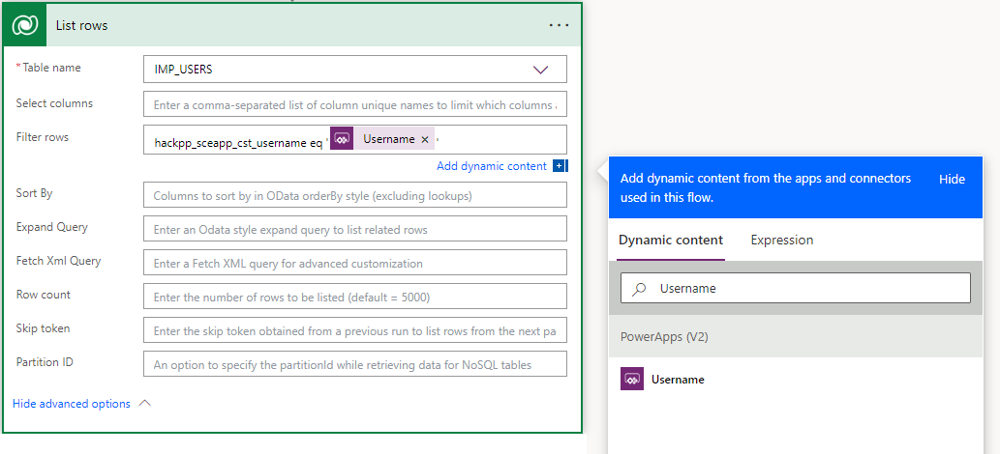
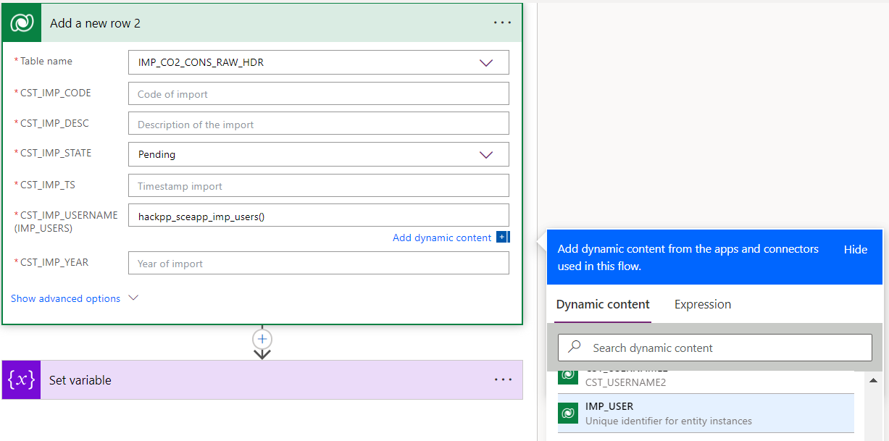
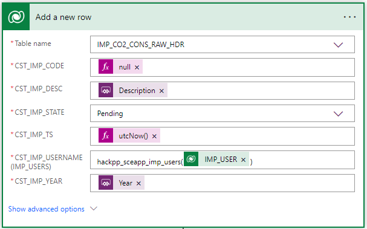

# 1. Introduction to Flows

You should now have Completed the Following things:

1. Importing Implemented Artefacts
2. Implement Wizard Step 1 (Part1)

Next you will complete the implementation of the first step of the wizard.

# 2. Implementation Task

## Introduction

We will now replace the notification with code to persist the changes in dataverse. We will use a different approach depending on the scenario:
* Edit: We will use the standard `SubmitForm` command
* New: We will implement an embedded flow.

The reason for the embedded flow is a limitation of the `SubmitForm` command if it is configure for new. So far no simple built-in way exists to retrieve the values of the newly created record. This is a problem because in our case the primary key of the record is autogenerated. That means we cannot infer the record from the user input. The only known workaround would to use all other columns as combined value to guarantee uniqueness. The embedded workflow gives us a chance to write the record AND to retrieve all values including the autogenerated primary key for the subsequent upload.

## Define Flow

To create an embedded flow click on the power automate icon `>>` and then click `+ Add flow` as shown below:

<br><br>

Click on `Create from blank` takes you to the flow designer:

<br><br>

In the designer you normally just see the initial step. The second step in the screesnhot just serves as illustration for the scenarios that can hit you.

<br><br>

The following general rules apply:
* To add an action at the end click on the button `New step`
* To expand a step do a left mouse single click on the step
* To insert a step between two existing ones click on the plus symbol between the steps
* Clicking the `Flow Checker` informs you about errors
* To delete a step click on the three dots right to the header. There you find an entry for removal.
* Saving the flow requires a name. Click on the text `Untitled` and enter your desired name. Afterwards press the save button.

In the next step we have to get the internal ID of the record holding the importing user. We will use the `List Rows` action within dataverse for that. Click `New Step` and enter `dataverse` in the search field as shown below:

<br><br>

Pick the action `List rows`. The screenshot below shows the added action:

<br><br>

Set the fields as shown in the table:
|Field           |Value                      |
|----------------|---------------------------|
| Table name     | IMP_USERS                 |
| Row count      | 1                         |

The expression for `Filter rows` we use for filtering the rows by the importing username that was specified in the form. The expression is `hackpp_sceapp_cst_username eq '<value from form>'`. Technically the value from the form is passed as parameter. We have to tell now Power Platform to generate a parameter for us. The screenshot below shows how that is done. Position the cursor in the parentheses and click in the field. Select in the tab `Dynamic Content` the expression `Ask in PowerApps`:

<br><br>

When you hover over the generated expression you also see the name of the expected parameter which is `Listrows_Filterrows` (Corresponds to `<name of action>_<name of field>`).

In the next step we will add a new row that represents our import. We will use the `Add a new row` action within dataverse. Click `New Step` and enter `dataverse` in the search field. Pick the action `List rows`. The screenshot below shows the action. Select `IMP_CO2_CONS_RAW_HDR` as table name. As a result the table specific tables will be shown as illustrated in the screenshot below. Mandatory fields are marked with an asteriks. The generated UI is not correct reagrding `CST_IMP_CODE`. Yes as logical primary key it is mandatory. However due to the auto generated definition no value would be mandatory. We will provide a dummy to satisfy the constraints:

<br><br>

As a first value we will set the value for CST_IMP_USERNAMES. Power Platform expects an expression `<EntitySetName>(<GUID of record>)>`. The entity set name in our case is `<EntityName>` and `<GUID of record>` is the result of the previous action. Enter `hackpp_sceapp_imp_users()` and position the mouse cursor into the parentheses. Power Platform will assist you in completing the dynamic expression needed here. Pick `IMP_USR` from the displayed options in the tab `Dynamic content` as shown in the screenshot.

<br><br>

When you selected the value you will notice a change, Dataverse embeds the new `Add new row` task in a for each loop since the previous command might return multiple rows. The screenshot below shows this new situation:

<br><br>

Let's try to understand `Apply tp each` better. It is working as major input on the output from the previous step displayed as ` value x`. To understand it you have to be aware of the JSON structure that is returned by `List rows`. Below you find a sample:
```
{
	"@odata.context": "https://orgc9bd3046.crm6.dynamics.com/api/data/v9.1/$metadata#cr953_workflowmaxes(cr953_jobid,cr953_...)",
	"@Microsoft.Dynamics.CRM.totalrecordcount": -1,
	"@Microsoft.Dynamics.CRM.totalrecordcountlimitexceeded": false,
	"value": [{
		"@odata.type": "#Microsoft.Dynamics.CRM.cst_users",
		"@odata.id": "https://domain.crm6.dynamics.com/api/data/v9.1/cst_users(cf5033a4-c9c8-eb11-bacc-00224817f...)",
		"hackpp_sceapp_imp_userid": "cf5033a4-c9c8-eb11-bacc-00154817f386"
    ...
	}]
}
```
The used path `body/value` is another word for navigating to the `value` property. As you can see in the JSON the property `value` is an array. The loop now cycles over each entry. We need the id which is shown as `IMP_USER x`. With the expression `items('Apply_to_each')?['hackpp_sceapp_imp_userid']` we pick the technical id we are interested in.

Expand the `Add new row` action again to set now the remaining fields. For setting `CST_IMP_TS` we use the built-in function `utcNow`. As you can see in the screenshot we are in the tab `Expression`. Enter it as formula in the bar:

<br><br>

Follow the instructions in the table for the rest:
|Field           |Value                                         |
|----------------|----------------------------------------------|
| CST_IMP_CODE   | Set the field to the special expression `null` as you did it for `utcNow`. Otherwise you get an error.     |
| CST_IMP_YEAR   | Use the way for adding a parameter as before |
| CST_IMP_DESC   | Use the way for adding a parameter as before |
| CST_IMP_STATE  | Fixed value for Pending                      |

When you have filled out everything your action should like the following:

<br><br>

As a last step we now have to return primary key of the newly created record. Enter `PowerApp` as category and add a new action `Respond to a PowerApp or flow`. In the beginning the task is empty and we have to create a return parameter by clicking on `Add an output`. Click on the button and select `Text`. You will then get the fields for a new named output as shown below:

<br><br>

Enter `returnedval` as name for the parameter. Click into the value field and let Power Platform assist you as shown in the screenshot below. The column with the primary key is named `CST_IMP_CODE`:

<br><br>

Before you leave the designer note the name of the flow you have defined. You will need it in the next step.

## Wire Flow with Submit Button

The following steps are necessary to add your flow:
* Add the new flow to your application
* Submit Button

**Regarding add flow)**

Click on the power automate icon and click the button `Add flow`. Enter the name under which you saved the flow.

**Submit Button)**

Our submit is different for edit and new. In the edit case we can use the standard `SubmitForm` to persist the changes. We just add a confirmation message for the user. For new we have run our flow and store returned value for later processing in a local variable. The user is also informed with an additional message. Enter the following formula in the property `OnSelected` that is doing all that (For <> you have to use the names you defined):
```
If(locImpMode = "New", 
   UpdateContext(
	{locParaUserName: <WizardStepImpHdrMainViewImportUserNameDropDown>.Selected.CST_USERNAME,
	 locParaYear: WizardStepImpHdrMainViewImportYearTextBox.Text,
	 locParaDesc: <WizardStepImpHdrMainViewImportDescTextBox>.Value});
   UpdateContext(
	 {locNewImpCode: TestFlowInp.Run(locParaUserName, locParaYear, locParaDesc).returnedval });
   Notify("Import " & locNewImpCode & " has been created."), 
   SubmitForm(WizardStepImpHdrMainView);
   Notify("Import " & WizardStepImpHdrMainView.LastSubmit.CST_IMP_CODE & " has been updated."))
```
The important takeaways from that code:
* Multiple expressions

  No special block identifiers as curly brackets in C are required to run multiple commands. Commands are just separated by semikolon.

* If expression

  The generic form of the if is `if(<test cond>, <expressions to run if true>, <expressions to run if false>). in our case the expressions for the if and the true case are just a bit longer.

* UpdateContext

  Sets the local variables to the values specified in curly brackets. The variables are only visible in the parent screen.

* Calling the flow

  Running a flow with parameters requires the run command as follows: `<flowname>.Run(<parameters separated by comma>)`. Referencing the return value is done by `.<name of return parameter>`.

* Notify: The expression shows an information message. The operator `&` concatenates strings.
* LastSubmit: Refers to the stored data. Unfortunately it only works for edit only.
* <...> Controls

  They represent the form controls that hold our data. Note that the way you access the data differs depending on the type.

# 3. Testing changes

Start from the import overview page to ensure a correct screen context. Press the play button after selecting the overview screen to start the tests. Thanks to your changes the following scenarios should now work:
|Test                                             |Expected Result          ,                |
|-------------------------------------------------|------------------------------------------|
|Wizard first step: Click on Submit button (new)  |You should see a new record in the dataverse table|
|Wizard first step: Click on Submit button (edit) |You should see the updated record in the dataverse table|

