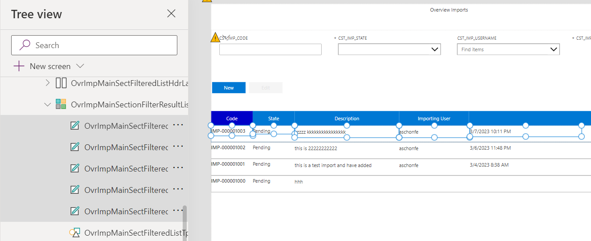

# 1. Introduction to Flows

You should now have completed the following things:

1. Importing implemented artefacts
2. Implement wizard step 1 (Part1)
3. Implement wizard step 2 (Part2)

Next you will adjust the standard layout according to the requirements of the customer.

# 2. Implementation Task

## Introduction

Custom pages come with a gallery control that allows you to display lists. The standard layout is as shown below. You have some flexibility to change the layout per entry but standard functionality such as filtering per column needs to be added manually.
<br><br>

The final goal is the approach we already implemented for showing the existing imports. For simplicity reasons we did it only for the import code.
<br><br>

As you can see we have now a tabular list layout and an extra header that allows us to sort the list according to a certain column. The column after we sort is indicated by different background color in the header.

## Apply tabular layout

To apply the layout you first have to understand better how the designer displays the control. The screenshot below illustrates important points:
<br><br>

Relevant for applying the tabular layout is not a built-in property in the right-hand side. The key is the template mechanism of the first row. The layout of the first row is applied to all others. The controls below the gallery show the controls of the first row. The rectangle serves as container for all controls on it. That means:
* Removing existing controls

  To drop controls just delete them from the container. In our case we don't need the image.

* Adding additional controls

  Just add them as you did it before. Only make sure that the container control is selected. You can achieve this by clicking near the borders of the first item in the list.

* Adjust existing controls

  The standard layout is achieved by just placing the labels per column vertically. To achieve a tabular layout just drag the controls side by side horizontally. The screenshot below illustrates this by the imports.
  <br><br>

Implement with these guidelines the same tabular layout as already done for the imports. The next chapter is about the extra header.

## Inserting the extra header row

Check the tree for the existing import to infer which additional controls are needed (Basically just a horizontal layout container + including buttons + a rectangle to fill the rest). You should be ramped up by now how controls are added. Therefore no further details are given.
<br><br>

## Filtering & Sorting

The basic idea is to store the filtered records in the local variable `locSelectedItems`. The following adjustments are necessary to get the right behavior:
* Initialization

  When we enter the page we must ensure the local variable is correct. Entering page might be triggered by visiting the page initially or because we press the `Home` button in the wizard. Set the property `OnVisisble` to the following value:
```
  UpdateContext(
    {
        ...,
        locSelectedItems: Filter(IMP_CO2_CONS_RAW_HDR, Find(OvrApprViewMainSearchFormImpCodeTextBox.Value,CST_IMP_CODE))
    }
)   
```
  `Find` checks each row from the table `IMP_CO2_CONS_RAW_HDR` whether the import code matches the text in the filter.

* Enable Edit Button

  The button must be only enabled if  exactly one row is selected. Hence the `DislayMode` has the following formula: `If(CountRows(locSelectedItems) = 1 , DisplayMode.Edit, DisplayMode.Disabled)`

* Call wizard Edit Button

  After a button click we have to navigate to the first step in the wizard. The `OnSelect` property must be set as follows: 
```
Navigate(WizardStepImpHeader, ScreenTransition.None, { 
    locImpState: Text(First(locSelectedItems).CST_IMP_STATE), 
    locImpCode: First(locSelectedItems).CST_IMP_CODE,
    locImpMode: "Edit" })
```

* Filter records

  When the user changes the test filters the list must be updated. Overwrite the `OnChange` event that is firing if we enter something.
```
UpdateContext({locSelectedItems: Filter(IMP_CO2_CONS_RAW_HDR, Find(OvrApprViewMainSearchFormImpCodeTextBox.Value,CST_IMP_CODE))})
```

Sorting the columns is also based on a local variable `locSortColumn`. It denotes the column we want to sort after. The following pieces ensure that the variable is kept up to date:
* Initialization

  When we enter the page we must ensure the local variable is correct. Entering page might be triggered by visiting the page initially or because we press the `Home` button in the wizard. Set the property `OnVisisble` to the following value:
```
UpdateContext(
    {
        locSortColumn: "Code",
        ...
    }
)     
```

* List

  The list must use as data source now the local variable and not the original table `IMP_CO2_CONS_RAW_HDR`. We have to ensure that we sort the records according to the selected column. In our case we only implemented the case for "Code". The following expression for the `Items`property is doing the job:
```
Switch(
    locSortColumn,
    "Code", Sort(
              locSelectedItems, 
              CST_IMP_CODE, SortOrder.Descending),
    "State", Sort(
              locSelectedItems, 
              CST_IMP_STATE, SortOrder.Descending),
    "ImpUser", Sort(
              locSelectedItems, 
              CST_IMP_USERNAME.CST_USERNAME, SortOrder.Descending),
    "Desc", Sort( 
              locSelectedItems, 
              CST_IMP_DESC, SortOrder.Descending),    
    locSelectedItems
)
```
  The major new command is now `Switch`. It allows to sort according to the value in `locSortColumn`. `locSelectedItems` contains the filtered records. If `locSortColumn` does not match any of the cases, the data is simply returned unsorted.

* Buttons in the header

  The color of the button shall change when we sort after that column. Setting the property `FillColor` to the following formula gets the job done: `If(locSortColumn = "State", RGBA(0, 0, 200, 1), RGBA(0, 120, 212, 1))`

  When we press the button the sort order needs to be changed which boils down to update our local variable in `OnSelect`:

```
UpdateContext(
    {
        locSortColumn: "Code"
    }
)
```

# 3. Testing changes

Thanks to your changes the following scenarios should now work:
|Test                                             |Expected Result                          |
|-------------------------------------------------|------------------------------------------|
|Run page with existing data  |The data should be displayed correctly, it should be sorted according to the default column and the corresponding button should have a different background color.|
|Click on button in the header |The list should be sorted according to that column|
|Enter values in the form fields |The rows in the form should be filtered according to your criteria|

