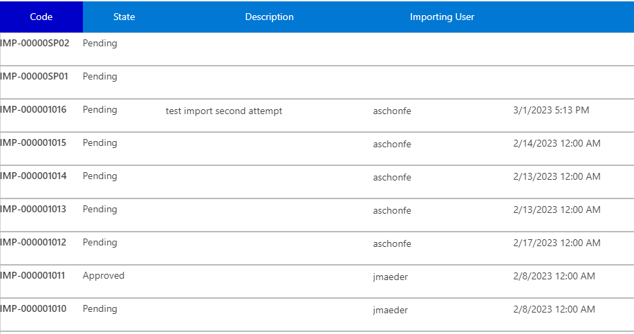
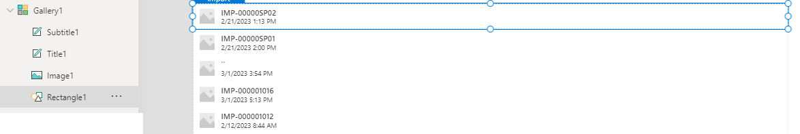

# 1. Introduction to Flows

You should now have Completed the Following things:

1. Importing Implemented Artefacts
2. Implement Wizard Step 1 (Part1)
2. Implement Wizard Step 2 (Part2)

Next you will adjust the standard layout according to the requirements of the customer.

# 2. Implementation Task

## Introduction

Custom pages come with a gallery control that allows you to display lists. The standard layout is as shown below. You have some flexibility to change the layout per entry but standard functinality such as filtering per column needs to be added manually.

  

The final goal is the approach we already implemented for showing the existing imports.

  

As you can see we have now a tabular list layout and an extra header that allows us to sort the list according to a certain column. The column after we sort is indicated by the a different background color in the header.

## Apply tabular layout

To apply the layout you first have to understand better the way how the designer displays the control. The screenshot below illustrates import points:

  

Relevant for the applying the layout is not a built-in property in the right-hand side. Important to understand is the template mechanism of the first row. The layout of the first row is applied to all others. The controls below the gallery show the controls of the first row. The rectangle serves as container for all controls on it. That means:
* Removing existing controls

  To drop controls just deletem them from the container. In our case we don't need the image.

* Adding additional controls

  Just add them as you did it before. Only make sure that the container control is selected. You can achieve this by clicking near the borders of the first item in the list.

* Adjust existing controls

  The standard layout is achieved by just placing the labels per column vertically. To achieve a tabular layout just drag the controls side by side horizontally.

Implement with these guidelines the same tabular layout as shown in the second picture above. The next chapter is about the extra header.

## Add header row

TODO as discussed Preethi 

# 3. Testing changes

Thanks to your changes the following scenarios should now work:
|Test                                             |Expected Result                          |
|-------------------------------------------------|------------------------------------------|
|Run page with existing data  |The data should be displayed correctly, it should be sorted accrding to the default column and the corresponding button should have a different background color.|
|Click on button in the header |The list should be sorted according to that column|
|Enter values in the form fields |The rows in the form should be filtered according to your criteria|

