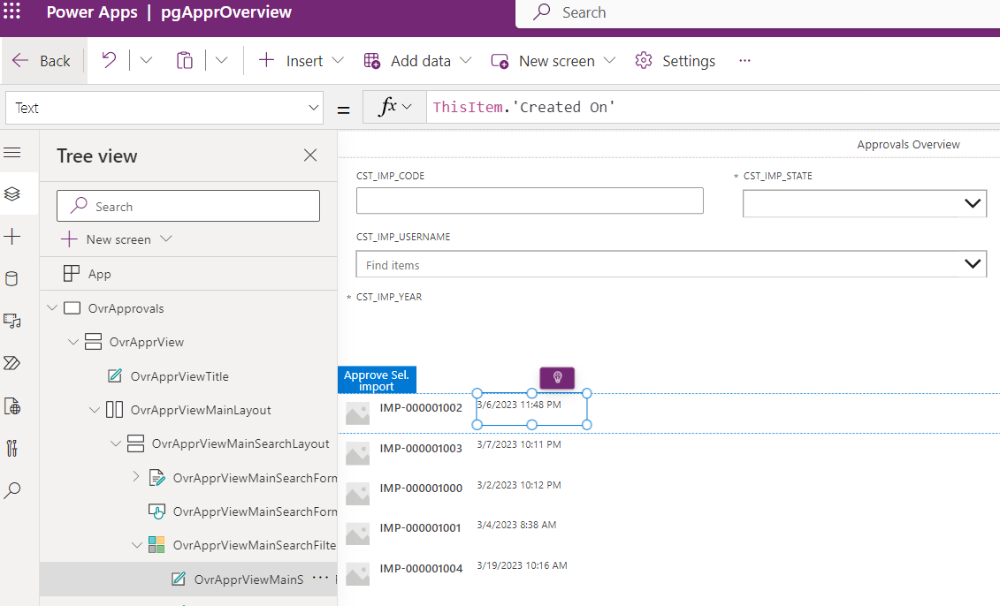
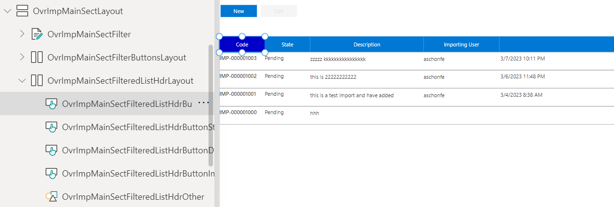

# 1. Introduction to Flows

You should now have completed the following things:

1. Importing implemented artefacts
2. Implement wizard step 1 (Part1)
3. Implement wizard step 2 (Part2)

Next you will apply the extended layout of the import overview to tje approval page.

# 2. Goal

Custom pages come with a gallery control that allows you to display lists. The standard layout is as shown below. You have flexibility to change the layout per entry but standard functionality such as filtering per column needs to be added manually.
<br><br>

The final goal is the approach we already implemented for showing the existing imports. For simplicity reasons we did it only for the import code.
<br><br>

As you can see we have now a tabular list layout and an extra header that allows us to sort the list according to a certain column. The column after we sort is indicated by different background color in the header.

# 3. Implementation Task

## Apply tabular layout

Navigate to the page for approvals named `pgApprOverview` within the app as shown in the screenshot below and click the edit icon:
<br><br>

To apply the layout you first have to understand better how the designer displays the control. The screenshot below illustrates important points:
<br><br>

Relevant for applying the tabular layout is not a built-in property in the right-hand side. The key is the template mechanism of the first row. The layout of the first row is applied to all others. The controls below the gallery show the controls of the first row. The rectangle serves as container for all controls on it. That means:
* Removing existing controls

  To drop controls just delete them from the container. In our case we don't need the image.

* Adding additional controls

  We will reuse the existing two labels. So we just need additional labes to cover the remaining columns. Just add them as you did it before. Only make sure that the container control is selected. You can achieve this by clicking near the borders of the first item in the list.

* Adjust existing controls

  The standard layout is achieved by just placing the labels per column horizontally. To achieve a tabular layout just drag the labels side by side. The screenshot below illustrates this.
  <br><br>

  The most important setting per label is the `Text` property. Normally you have static text but this time we have to reference the column to be displayed. The required expression is `ThisItem.<name of table column>`. `ThisRecord` refers to the current record displayed later. The screenshot below shows an example:
  <br><br>
  
Implement with these guidelines the same tabular layout as already done for the imports. The next chapter is about the extra header.

## Inserting the extra header row

Check the tree for the existing import to infer which additional controls are needed (Basically just a horizontal layout container + including buttons + a rectangle to fill the rest). You should be ramped up by now how controls are added. Therefore no further details are given.
<br><br>

## Filtering

The basic idea is to store the filtered records in the local variable `locSelectedItems`. The following adjustments are necessary to get the right behavior:

**Initialization)**

When we enter the screen we must ensure the local variable is correct. Entering the page might be triggered by visiting the page initially or because we press the `Home` button in the wizard. Set the property `OnVisisble` to the value given below. `Find` checks each row from the table `IMP_CO2_CONS_RAW_HDR` whether the import code matches the text in the filter:
```
  UpdateContext(
    {
        ...,
        locSelectedItems: Filter(IMP_CO2_CONS_RAW_HDR, Find(OvrApprViewMainSearchFormImpCodeTextBox.Value,CST_IMP_CODE))
    }
)   
```
  
**Filter records in list)**

To ensure the list displays the values from our variable set the `Items` property to `locSelectedItems` as data source. When the user changes the filters the list must be updated. The relevant control is the text box `OvrApprViewMainSearchFormImpCodeTextBox` within the card for the import code. Implement the `OnChange` event that is firing if we enter something.
```
UpdateContext({locSelectedItems: Filter(IMP_CO2_CONS_RAW_HDR, Find(OvrApprViewMainSearchFormImpCodeTextBox.Value,CST_IMP_CODE))})
```
  The expression recalculates `locSelectedItems` the data source for our list, which causes the list to change. Apply this approach to all other columns.

## Sorting

Sorting the columns is also based on a local variable `locSortColumn`. It denotes the column we want to sort after. The following pieces ensure that the variable is kept up to date.

**Initialization)**

When we enter the screen we must ensure the local variable is correctly initialized. We use the import code as default. Set the property `OnVisisble` to the following value:
```
UpdateContext(
    {
        locSortColumn: "Code",
        ...
    }
)     
```

**Sort records in list)**

We have to ensure now additionally that we sort the records according to the selected column. In our case we only implemented the case for "Code". The expression for the `Items`property below shows the maximum case where sorting for all columns needs to be supported:
```
Switch(
    locSortColumn,
    "Code", Sort(
              locSelectedItems, 
              CST_IMP_CODE, SortOrder.Descending),
    "State", Sort(
              locSelectedItems, 
              CST_IMP_STATE, SortOrder.Descending),
    "ImpUser", Sort(
              locSelectedItems, 
              CST_IMP_USERNAME.CST_USERNAME, SortOrder.Descending),
    "Desc", Sort( 
              locSelectedItems, 
              CST_IMP_DESC, SortOrder.Descending),    
    locSelectedItems
)
```
The major new command is now `Switch`. It allows to sort according to the value in `locSortColumn`. If `locSortColumn` does not match any of the cases, the data is simply returned unsorted.

**Visualize sort criteria & adjust sort criteria)**

The color of the button shall change when we sort after that column. Setting the property `FillColor` to the following formula gets the job done: `If(locSortColumn = "State", RGBA(0, 0, 200, 1), RGBA(0, 120, 212, 1))`

When we press the button the sort order needs to be changed which boils down to update our local variable in `OnSelect`. The example below is for the button of the import code column. Do it for the other ones according to the values used in the switch statement:

```
UpdateContext(
    {
        locSortColumn: "Code"
    }
)
```

# 4. Testing changes

Thanks to your changes the following scenarios should now work:
|Test                                             |Expected Result                          |
|-------------------------------------------------|------------------------------------------|
|Run page with existing data  |The data should be displayed correctly, it should be sorted according to the default column and the corresponding button should have a different background color.|
|Click on button in the header |The list should be sorted according to that column|
|Enter values in the form fields |The rows in the form should be filtered according to your criteria|

