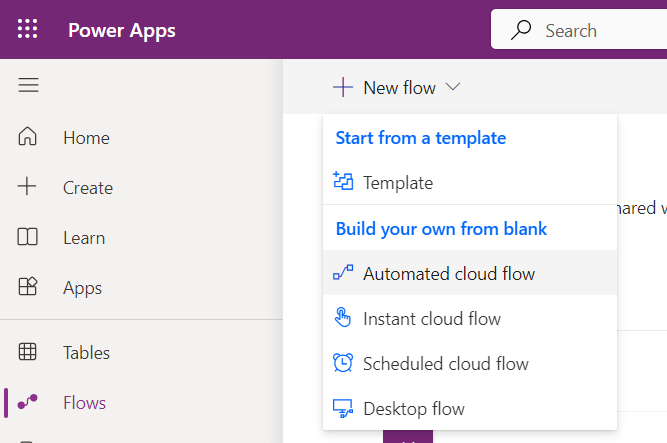
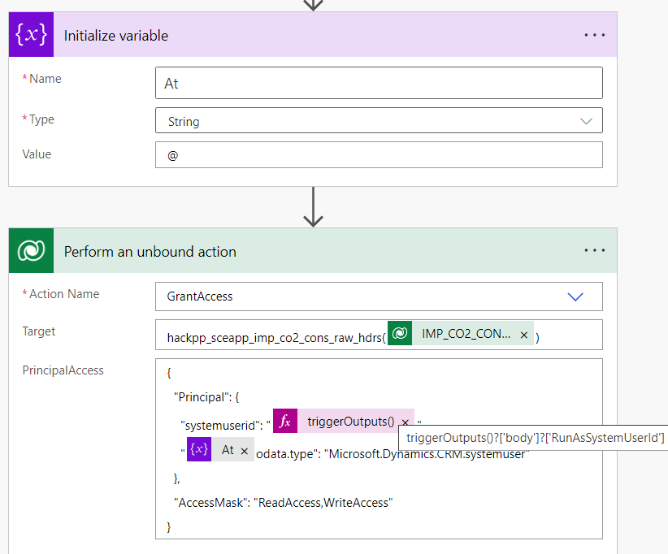
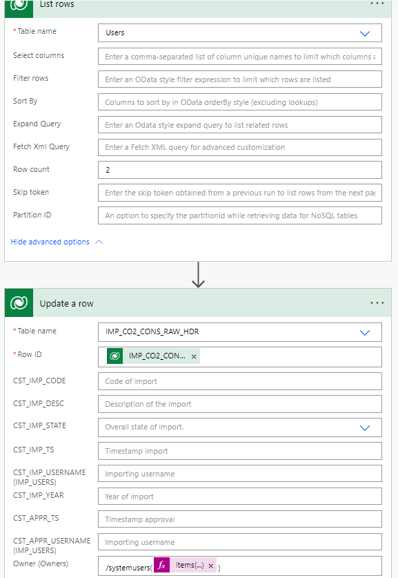

# 1. Introduction to row level security

You should now have Completed the Following things:

1. Importing implemented Artefacts
2. Implement Wizard Step 1 (Part2)

Next you will learn the different row level security options to give rights on each entity.

# 2. All Options:

There are several ways to handle the security of your Dataverse tables. The basis of all of them are access rights via roles. Pre-defined is a hierarchical data access structure, which counts the higher hierarchical rights over the lower ones. This means you can't limit an individual user's rights, if their team or even business unit already gave them. The structure looks as follows:

1. Organisation (Root Business Unit)
2. Child Business Units
3. Team
4. User

Where Child Business Units are optional and can be under another (Child) Business Unit.

Each of them can be given some of these access rights to its underlying users:

- CreateAccess
- ReadAccess
- WriteAccess
- DeleteAccess
- AppendAccess
- AppendToAccess
- AssignAccess
- ShareAccess

Besides whole Organisation owned or User/Team owned table permissions we can also give more granual rights per column or per row/entity. When we are going to look at row level permissions you must know that each one has a pre-defined column `Owner` and a corresponding `Owningbusinessunit` where it was created in, which you can simply overwrite to a different user/team/business unit. The Owner only sees his own entitys and can be a single user or a single team with multiple users inside.

Another way to give rights to multiple users or even multiple teams is by sharing access. This method is less documented and tougher to troubleshoot because it's not a consistently implemented access control, but needed if there are no dedicated teams defined.

# 3. Goal

We will create an example flow to share access rights on a single entity to individual users.

The reason for this approach is that it allows the most granual control over an entity to an additional single user, to only give access to the appropriate levels of information that is required to do their jobs.

# 4. Implementation Task

## Define Flow

### Start the flow designer

To create an automated flow click on `Flows` in the [Power Apps Maker](https://make.powerapps.com/) and then create a new named automated flow with the trigger `When a row is added, modified or deleted` from Microsoft Dataverse:
<br><br>

The following general rules apply:
* To add an action at the end click on the button `New step`
* To expand a step do a left mouse single click on the step
* To insert a step between two existing ones click on the plus symbol between the steps
* Clicking the `Flow Checker` informs you about errors
* To delete a step click on the three dots right to the header. There you find an entry for removal.
* Saving the flow requires a name. Click on the text `Untitled` and enter your desired name. Afterwards press the save button.

### Implement flow logic

In the next step we have to get the internal ID of the record being added, modified or deleted. We will use the `When a row is added, modified or deleted` action within dataverse for that. 

Set the fields as shown in the table:
|Field           |Value                      |
|----------------|---------------------------|
| Change type    | Added or Modified         |
| Table name     | IMP_CO2_CONS_RAW_HDR      |
| Scope          | Organization              |
| Select columns | cr181_cst_imp_state       |
| Run as         | Modifying user            |


After running a test this should give us the output of a body containing:
- `"hackpp_sceapp_imp_co2_cons_raw_hdrid": "c210849e-31cb-ee11-9079-002248e466b9"`
- `"_ownerid_value": "75591718-bcb3-ee11-a569-002248e466b9"`
- `"_modifiedby_value": "75591718-bcb3-ee11-a569-002248e466b9"`
- `"RunAsSystemUserId": "75591718-bcb3-ee11-a569-002248e466b9"`

In our example the user is the same person who created and modified the entity and thereby who triggered the function as the RunAsSystemUser. Because we have no other user we are going to share ourself the access rights. 

Add a new Step and select `Perform an unbound action` from Dataverse. This action is a multitool for several functions and is not bound (associated with a table).

For `Action Name` you pick `GrantAccess` (or in other cases RevokeAccess). It will update the format of the action to fit your requested action with 2 new fields: Target and PrincipalAccess.
For Target you must find your logical name of your Table. In this case it is hackpp_sceapp_imp_co2_cons_raw_hdr.
Additionally you must pluralise the term by replacing the ending -y with -ies or else just adding -s and add its GUID inside Parentheses: `hackpp_sceapp_imp_co2_cons_raw_hdrs(GUID)`. You must replace the GUID placeholder with the dynamic content of `IMP_CO2_CONS_RAW_HDR`.
For PrincipalAccess the formular expects you to input valid JSON code, which you can not fully comply yet unless you follow the following steps:
```
{
  "Principal": {
    "systemuserid": "",
    "@odata.type": "Microsoft.Dynamics.CRM.systemuser"
  },
  "AccessMask": "ReadAccess,WriteAccess"
}
```
- Hint: To add a team instead of a user you would replace CRM.systemuser with CRM.team and systemuserid with teamid.

1. Fill the value of systemuserid with the expression `triggerOutputs()?['body']?['RunAsSystemUserId']`. The questionmarks return null instead of error when its element could not be found. With this expression we input the RunAsSystemUserId from the body from the Output of our starting trigger.
2. Replace the @ with a variable of @. The @ is an excape character and you can row 2 @@ to fix it temporarily, but the best and permanent solution is to insert a variable containing `@`:
  
  a. Insert a new Step above the `Perform an unbound action` by clicking on the `+` on the arrow and selecting `Add an action`. Choose `Initialize variable` as action. Name it `At` with the type of `String` and the value `@`.
  
  b. Replace the @ in PrincipalAccess with the Variable.

After all steps are done the flow should look like this and you can save it without an error.
<br><br>


To remove our user from the owner column you must specify a different one. Since you can't create a new one we select a random one that exist for technical reasons:
1. Add a new step
2. Add the action `List rows` from Dataverse
3. Select the Table name: `Users`
4. Set Row count to `2`
5. Add a new step
6. Add the action `Update a row` from Dataverse
7. Select Table name `IMP_CO2_CONS_RAW_HDR`
8. For Row ID input the dynamic content of `IMP_CO2_CONS_RAW_HDR`
9. For Owner (Owners) insert `/systemusers()` with the expression `items('Apply_to_each')?['systemuserid']?[1]` inside the parenthesis.

* Notice that the Owner input needs the pluralised logical name of the table user with a leading `/` and that you select the second element of systemuserid inside the output of List Rows.
<br><br>


# 4. Testing changes

Start from the import overview page to ensure a correct screen context. Press the play button after selecting the overview screen to start the tests. Thanks to your changes the following scenarios should now work:
|Test                                             |Expected Result          ,                |
|-------------------------------------------------|------------------------------------------|
|Wizard first step: Click on Submit button (new)  |You should see a new record in the dataverse table after clicking submit with a different owner.|
|Wizard first step: Click on Submit button (edit) |You should see the updated record in the dataverse table  with a different owner.|

