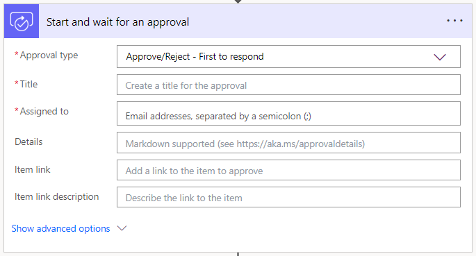
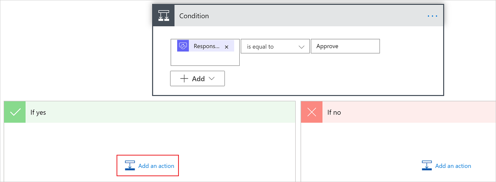

# 1. Introduction to Flows

You should now have Completed the Following things:

1. Importing database
2. Implement Wizard Step 1 (Part1)
3. Implement Wizard Step 1 (Part2)

Next you will complete the implementation of the first step of the wizard.

# 2. Implementation Task

## Introduction

Now we will implement the approval flow. The flow is triggered by the importing user when the importing state is set to finalized. The approver will be informed via mail that an action from his side is required.

From there the approval can be triggered in two ways:
1. The approver confirms the mail sent
2. The approver presses the button "Approve" in the app

We will only implement the missing parts in the first option. Implementing the second option is more difficult since it requires an [HTTP](https://powerusers.microsoft.com/t5/Building-Flows/Programmatically-trigger-approval-request/m-p/1917939) request that causes the approval flow to move on, as the approver would have sent an approval.

## Complete Flow

The following things are already implemented:
* Triggering of the flow when you click the `Request Approval` button
* The action when the request is approved => in our case copying over of the raw data to the table with the accumulated figures

What needs to be implemented by you within the flow:
* Triggering sending an EMail to the approver
* Only execute action when approval was given by mail
* Writing of comment if approval refused

Click on the plus sign after the first step to add a new one. Select `Approvals`as category and select the action `Start and wait for an approval`. The screenshot shows the fields:

  

TODO fields

Now we have to add a condition to trigger the correct action based on the decision of the approver (Approve or decline). Select `Control` as category and select the action `Condition`. Now you have to specify the condition for branching as shown in the screenshot shows:

  

Now we have to move the existing steps for copying the data to accumulated CO2 consumption in the `If yes` part. Do the the following for all steps top down. Drag the steps with an initial left click on the header over the yes-area and drop them. At the end your flow should look like the screenshot below:

TODO

## Implement Custom Connector

TODO
Would be interesting scenarion - checkout that
https://learn.microsoft.com/en-us/connectors/custom-connectors/paconn-cli

# 3. Testing changes

TODO
