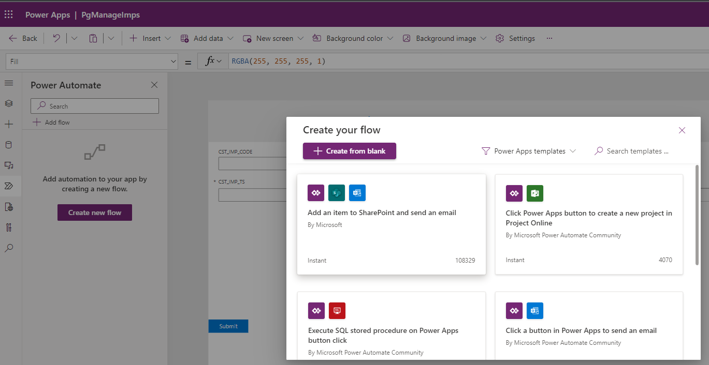
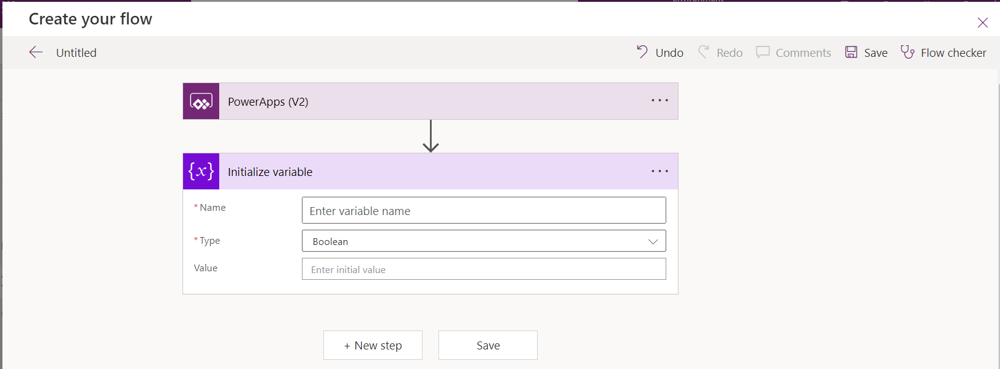
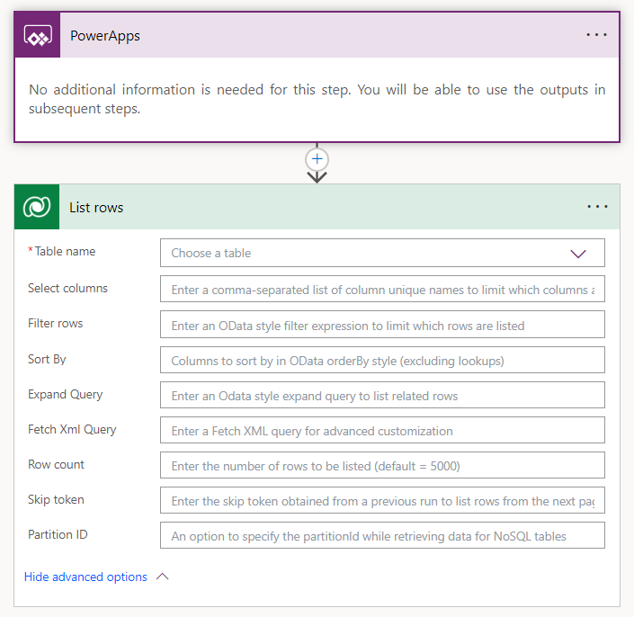

# 1. Introduction to Flows

You should now have Completed the Following things:

1. Importing implemented Artefacts
2. Implement Wizard Step 1 (Part1)

Next you will complete the implementation of the first step of the wizard.

# 2. Goal

We will now replace the notification with code to persist the changes in dataverse. We will use different approaches for new and edit:
* Edit: We will use the standard `SubmitForm` command
* New: We will implement an embedded flow.

The reason for the embedded flow is a limitation of the `SubmitForm` command when creatng a new record. So far no simple built-in way exists to retrieve the values of the newly created record. This is a problem because in our case the primary key of the record is autogenerated. That means we cannot infer the record from the user input. The only known workaround would be to use all other columns as combined key to guarantee uniqueness. The embedded workflow gives us a chance to write the record AND to retrieve all values including the autogenerated primary key for the subsequent upload. Moreover it is the perfect opportunity to play with PowerAutomate hands-on.

# 3. Implementation Task

## Define Flow

### Start the flow designer

To create an embedded flow click on the power automate icon `>>` and then click `Create new flow` as shown below:
<br><br>

Clicking on `+ Add flow` takes you to the flow designer:
<br><br>

In the designer you normally just see the initial step. The second step in the screesnhot just serves as illustration for the scenarios that can hit you.
<br><br>

The following general rules apply:
* To add an action at the end click on the button `New step`
* To expand a step do a left mouse single click on the step
* To insert a step between two existing ones click on the plus symbol between the steps
* Clicking the `Flow Checker` informs you about errors
* To delete a step click on the three dots right to the header. There you find an entry for removal.
* Saving the flow requires a name. Click on the text `Untitled` and enter your desired name. Afterwards press the save button.

### Implement flow logic

In the next step we have to get the internal ID of the record holding the importing user. We will use the `List Rows` action within dataverse for that. Click `New Step` and enter `dataverse` in the search field as shown below:
<br><br>

Pick the action `List rows`. The screenshot below shows the added action:
<br><br>

Set the fields as shown in the table:
|Field           |Value                      |
|----------------|---------------------------|
| Table name     | IMP_USERS                 |
| Row count      | 1                         |

The expression for `Filter rows` we use for filtering the rows by the importing username that was specified in the form. The required expression is `hackpp_sceapp_cst_username eq '<value from form>'`. 
`hackpp_sceapp_cst_username` is one of the various internal column names of the `CST_USERNAME` in the targeted table. 
To populate `<value from form>` we have to generate a new parameter. The screenshot below shows how that is done. Click into the field with the above expression. If you don't see an extra window click the small link under the field named `Add dynamic content`. Select in the tab `Dynamic Content` the entry `Ask in PowerApps`. The screenshot shows the reaction of the designer after `Ask in PowerApps` was picked.

**NOTE: The generated expression must be inside the single quotes.**
<br><br>

When you hover over the generated expression you see the name of the expected parameter which is `Listrows_Filterrows` (Corresponds to `<name of action>_<name of field>`).

In the next step we will add a new row that represents our import header. We will use the `Add a new row` action within dataverse. Click `New Step` and enter `dataverse` in the search field. Pick the action `Add a new row`. The screenshot below shows the action. Select `IMP_CO2_CONS_RAW_HDR` as table name. As a result the table specific columns will be shown as illustrated in the screenshot below. Mandatory fields are marked with an asteriks. The generated UI is not correct reagrding `CST_IMP_CODE`. Yes as logical primary key it is mandatory. However due to the auto generated definition no value is required. We will provide a special dummy to satisfy the constraints:
<br><br>

As a first value we will set the value for CST_IMP_USERNAMES. Power Platform expects an expression `<EntitySetName>(<GUID of record>)>`. The entity set name in our case is `hackpp_sceapp_imp_users` and `<GUID of record>` is the result of the previous action. Enter `hackpp_sceapp_imp_users()` and position the mouse cursor into the parentheses. Power Platform will assist you in completing the dynamic content needed here. Pick `IMP_USER` from the displayed options in the tab `Dynamic content` as shown in the screenshot.


# NOTES:

When a row is added, modified or deleted
Change Type: Added or Modified
Scope: Organization
Run as: Modifying user

Current time

Compose -> Inspecting

@ Variable

Perform an unbound action
GrantAccess/RevokeAccess
cr195_poc_tab_trackings(@{triggerOutputs()?['body/cr195_poc_tab_trackingid']}) -> copy logical table name and pluralise it (-s or -ies)

{
  "Principal": {
    "systemuserid": "@{triggerOutputs()?['body']?['RunAsSystemUserId']}",
    "@{variables('AT')}odata.type": "Microsoft.Dynamics.CRM.systemuser"
  },
  "AccessMask": "ReadAccess,WriteAccess"
}


## Wire Flow with Submit Button

We replace now the `OnSelect`property from the previous step. We plan for different ways to persist the changes. In the edit case we can use the standard `SubmitForm` to persist the changes. We just add a confirmation message for the user. For new we have run our flow and store returned value for later processing in a local variable. The user is also informed with an additional message. Enter the following formula in the property `OnSelect` that is doing all that (You have insert your flow name):
```
   Notify("Import " & locNewImpCode & " has been created."), 
   SubmitForm(WizardStepImpHdrMainView);
   Notify("Import " & WizardStepImpHdrMainView.LastSubmit.CST_IMP_CODE & " has been updated."))
```
The important new takeaways from that code are:
* Multiple expressions

  No special block identifiers as curly brackets in C are required to run multiple commands. Commands are just separated by semikolon.

* If expression

  The generic form of the if is `if(<test cond>, <expressions to run if true>, <expressions to run if false>). In our case the expressions for the if and the true case are just a bit longer.

* UpdateContext

  Sets the local variables (scoped per screen) to the values specified in curly brackets.

* Calling the flow

  Running a flow with parameters requires the run command as follows: `<flowname>.Run(<parameters separated by comma>)`. Referencing the return value is done by `.<name of return parameter>`.

* LastSubmit: Refers to the stored data. Unfortunately it only works for edit only.

# 4. Testing changes

Start from the import overview page to ensure a correct screen context. Press the play button after selecting the overview screen to start the tests. Thanks to your changes the following scenarios should now work:
|Test                                             |Expected Result          ,                |
|-------------------------------------------------|------------------------------------------|
|Wizard first step: Click on Submit button (new)  |You should see a new record in the dataverse table after clicking submit. The displayed message should be accordingly.|
|Wizard first step: Click on Submit button (edit) |You should see the updated record in the dataverse table. The displayed message should be accordingly.|

