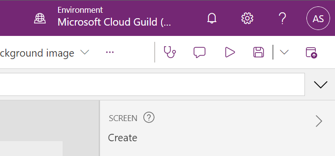
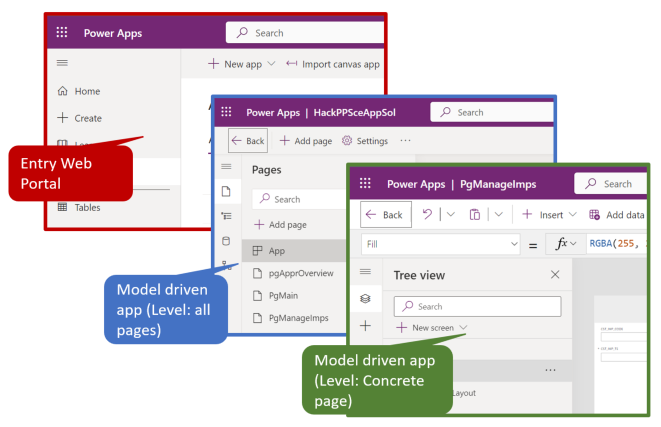

# 1. Introduction to Saving/ Versioning

You should now have Completed the Following things:

1. Importing implemented Artefacts
2. Implement Wizard Step 1 (Part1)
3. Implement Wizard Step 1 (Part2)

So far you have been using to `Save` to save the changes you have done. Behind the scene PowerApps creates new versions with each save and also keeps track of the last published version.

Being aware of that is beneficial when you want to rollback unwanted changes you did not intend. A simple undo/ revert you do of course still directly in the editor. This might be that easy anymore if your changes affect many controls partially. This task makes you aware of the versions behind and you will simulate an unwanted change that you rollback right afterwards.

# 2. Goal

Being able at the end of these steps to rollback unwanted changes by using the version history. 

# 3. Restore elder version PowerApps

## Save any pending changes

Make sure before you proceed that you have saved any pending changes by clicking the disk icon or hit `[ctrl+S]` on your keyboard now.
  
Publish this version with the button next to the disk to the right, or using `[ctrl+shift+P]`.

## Simulate unwanted change

We are going to test rolling back to an older version in case you brake something and can't undo the changes.
Therefore click onto the new form `WizardStepImpHdrMainView` and add a `Rectangle`, which will add a very noticeable blue box onto your screen. Save this version WITHOUT PUBLISHING it with the disk symbol again.

## Restore elder version

For managing versions you have to go back to the solution. An overview of the version is also directly available within the editor. Multiple ways exist:
* Manually navigate to solutions
  
  On the top, far left, above the `Tree View`and under the colored title `Power Apps  |  PgManageImps (Editing)` is an arrow with the text `Back`.
  Use it once to go back to the `all pages` level.
    

  Use it again to go back to the objects of your solution:
    

  Our unwanted change affected `PgManageImps`. Click at the context menu of the page `PgManageImps` and select the entry `Details`. The tab `Versions` contains the versions we are interested in. 

* Use Version History in editor

  The screenshot shows how you can reach the version history:
    
  You will see then a list of versions and also the one you published. With the link at the bottom of the modal dialog you can jump directly to the solution that will be also opened in a new browser tab.
  However, running restore without having left the app as above will result in an error since the App is locked. Therefore, the way above is required.

No matter which way you used you see now the list of versions resulting from each save. Last published version is marked by `Live`. 
  

Again you can just hit the `...` button to `Restore` a version. Do so for the version you published `Live` before. It will create a copy of that version as a newer version. Afterwards you can reload the project and the rectangle should be gone. Please check if your other changes are still in this version and redo them if not.
  

# 3. Restore elder version PowerAutomate

You are probably wondering if there is such a versioning system for flows as well. Even though this feature was planned to be already implemented it is not available yet. You can check [here](https://learn.microsoft.com/en-us/power-platform/release-plan/2023wave2/power-automate/use-versioning-solution-cloud-flows) if that has already been changed.
For now we are going to use the rather ugly way of copying and renaming. Navigate back to your solution as before but expand this time the flows inside the solution. In the screenshot the one listed flow is the one that creates the new row in dataverse.
  

Click at `Details` in the context menu (=`...`) for the flow in question. You will see a new view with all the details of the Flow and its run history. At the very top next to the Edit button is the `Save as` button. We will use it to create a copy of our flow and name it with a version number behind it. The screenshot below shows the details page with the `Save As` option.
  

Since it got a different name our app still relys on the first version name and therefore you should treat the flow without version number always as the newest, which you can replace with an older copy by removing the original and renaming the versioned flow back to the original.
