# 1. Introduction

For the given task (link) we tried an alternative approach with the goal to use as many of the tools and functions of the Power Platform as possible. The secondary goal that goes along with this apporach is that we want to minimize the number of lines of code that we must write for the app.
This leads to two major changes in comparison to the standard apporach:
- Using Table Based UI from the Dataverse
- Using a Business Process Flow to glue together the Table Based UI.
The use case to upload and import a file has not been implemented in this approach as it would have been similar to the other apporach and to save some time.

# 2. Creating the Tables and the UI in the Dataverse

Following the ideas of Microsoft for building a model driven app we start with creating the data model in the Dataverse.

## Creating the Tables
In this approach we start with modelling the business objects as Dataverse tables. There are 5 tables:

 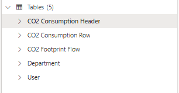 

## Creating the Tables
First we must give the table a name and the editor then automatically adds the plural name:
 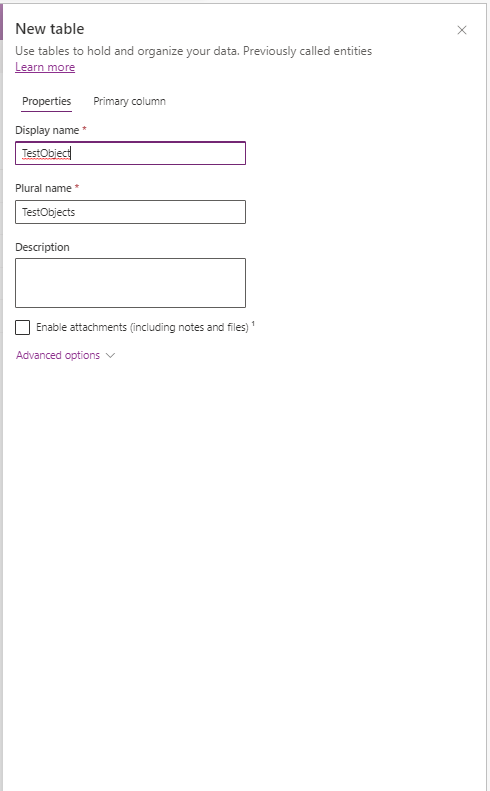 
Once the table has been created we can edit the columns. In our scenario we want to add the columns for our business scenario which can be done by clicking the "+" button.
 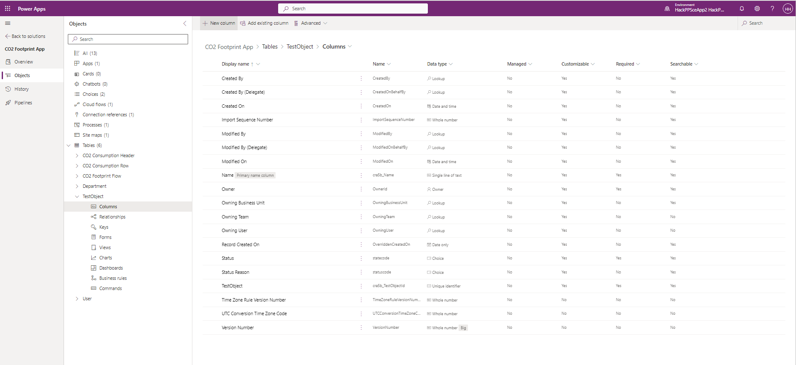 
There are already many columns for that table which have been automatically created by the Power Platform. Just ignore them and create the new colums you want. There are two special cases that need some consideration.
The first case are columns that allow only a limited set of values, usually called enums in programming languages. On the Power Platform those data types are called Choice.
 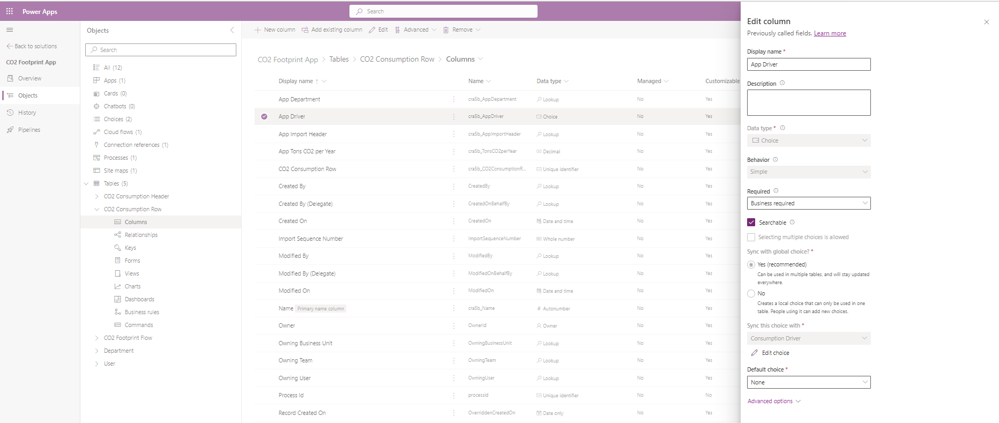 
When creating a column of type Choice the Power Platform lets you immediately create a new list of values and edit them:
 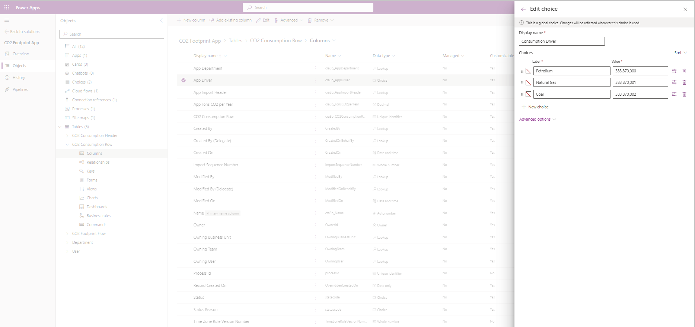 
The second special chase are foreign keys pointing to other tables with which we usually model 1:1 or 1:n relations. The corresponding data type is called Lookup. The only additional information you must give is the table that you are referencing.
 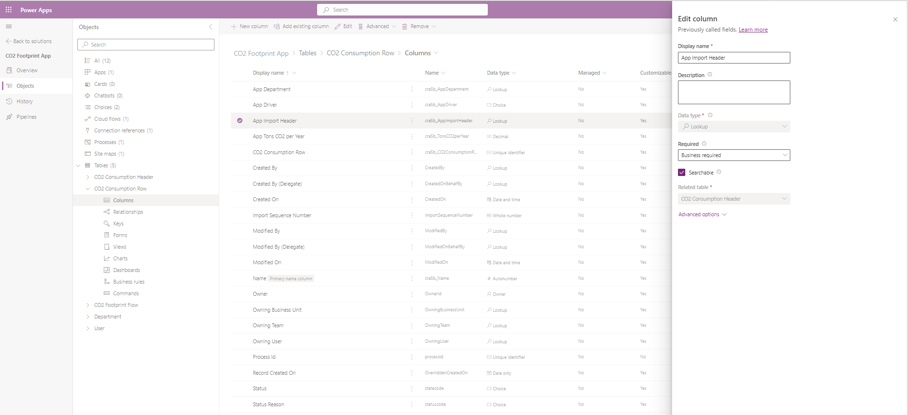 
For m:n relations you need a "helper" table with two Lookup columns that point to the two tables that have a m:n relation, this is similar to table modelling for relational databases.

## Tables Structure
The CO2ConsumptionHeader contains the data for one data inserting event. It can have several child row of the type CO2ConsumptionRow. The columns where the name starts with "App..." are the columns for our business scenario.
 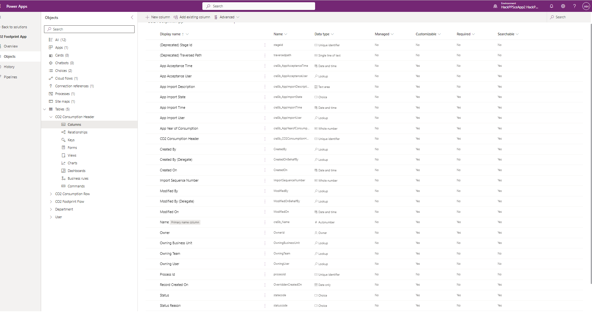 
The CO2ConsumptionRow contains the data for one Department, driver and year. Again, the columns where the name starts with "App..." are the columns for our business scenario.
 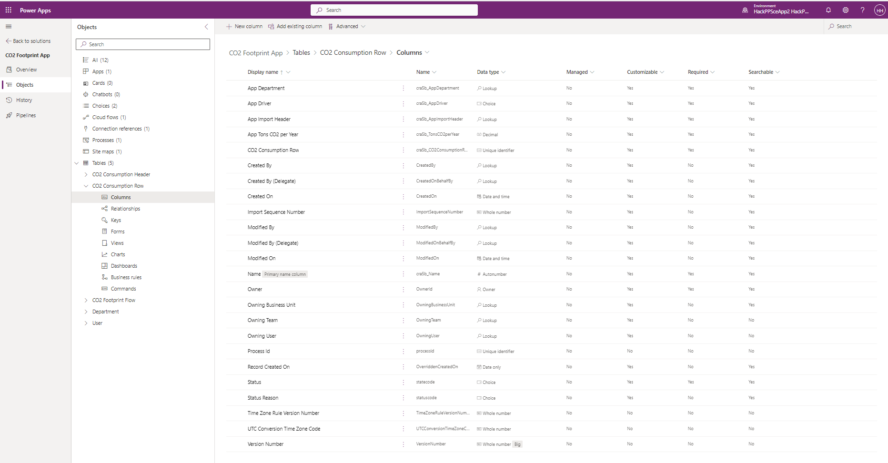 
This table was meant to save the import status, but it has become obsolte as we use a simple status model that is represented by the attribute "App Import State" in the table CO2ConsumptionHeader.
 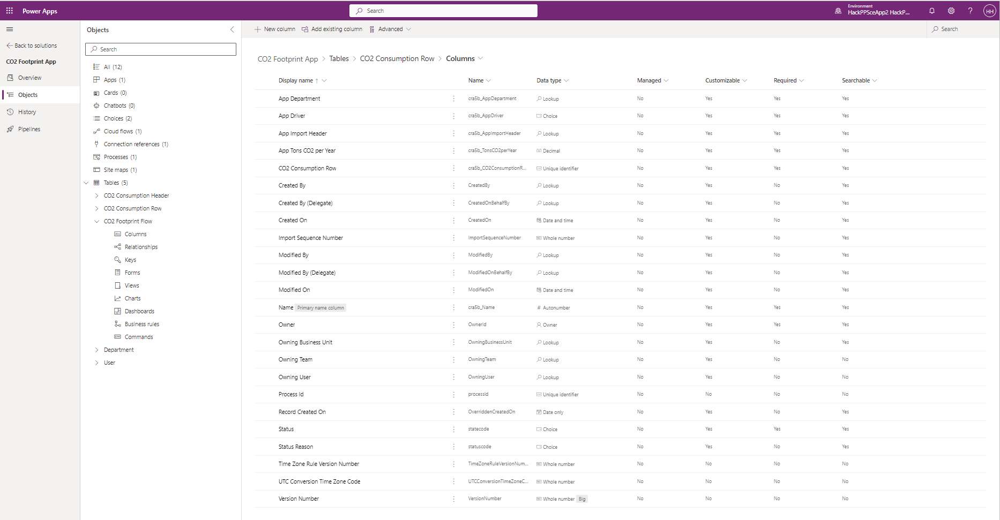 
This is a master data table for the departments. In this simple scenario we did not develop a UI for maintaining the entries. The standard UI which is generated by the Power Platform in the views for the table can be used for that.
 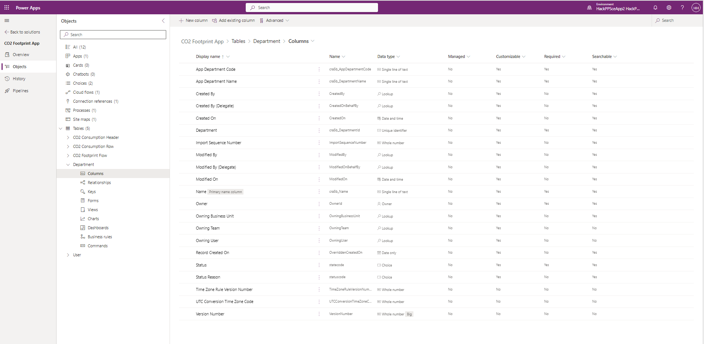 
This is a master data table for the users. In this simple scenario we did not develop a UI for maintaining the entries. The standard UI which is generated by the Power Platform in the views for the table can be used for that.
 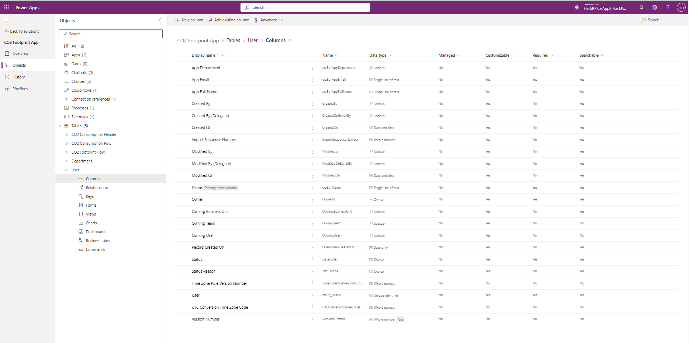 
In general we considered the master data maintenance to be out of scope for this simple scenario.

## Creating the UI
Creating the UI is where this approach really differs from the standard approach we chose in the Hackathon. While in our standard apporach we constructed the UI by composing the masks by adding atomic UI widgets like buttons, text boxes, labels, etc. in this apporach we only define UI representations for the data that are part of the Dataverse functions for a table. For every Dataverse table there are two UI features, called Forms and Views that are available for every Dataverse table. Here you can see them for the CO2ConsumptionHeader table.
 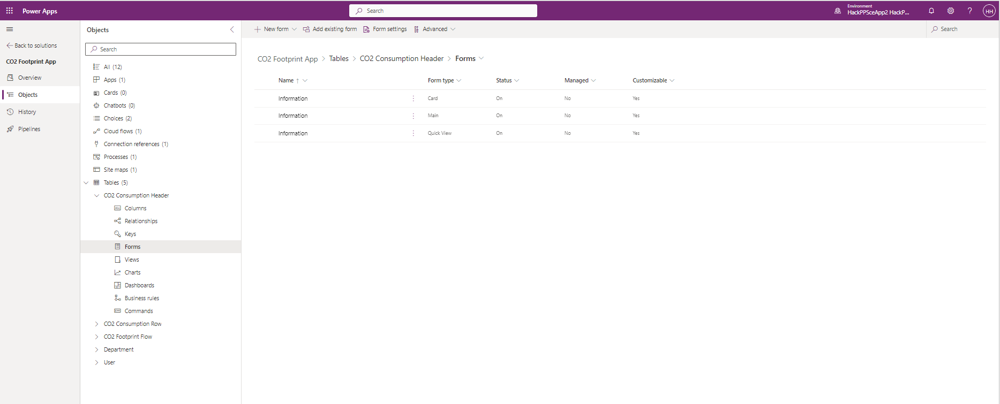 
 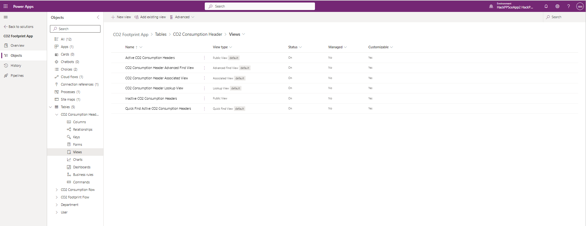 
You can also see that the Dataverse automtically creates some Forms and Views for every table when the table is created. You can modify the Forms and Views that were automatically created (which we did), or create new ones macthing your requirements. The Forms in general represent a perpective on one single row of the table while the Views represent a perspective on multiple rows of the table. These are the two different building blocks that the Dataverse designers envisioned for us to construct the UI. Besides Forms and Views you can still create complete customized masks as we did in our standard approach for the Hackathon. But since our business scenario was simple enough we only used Forms and Views to construct the ui for the alternative approach. We did not need other masks.

Since the data maintenance use cases for the users and departments were out of scope we only constructed on Form and one View for the CO2ConsuptionHeader and the CO2ConsuptionRow tables. That was enough for our simple data inserting/updating use cases:
 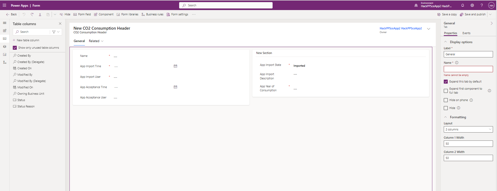 
 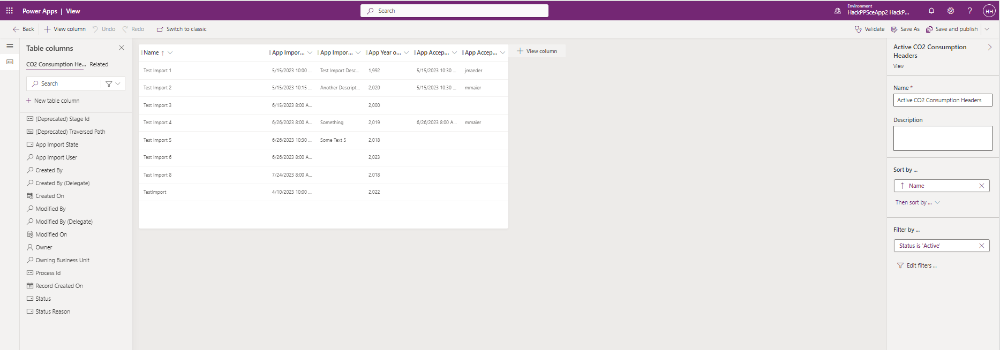 
 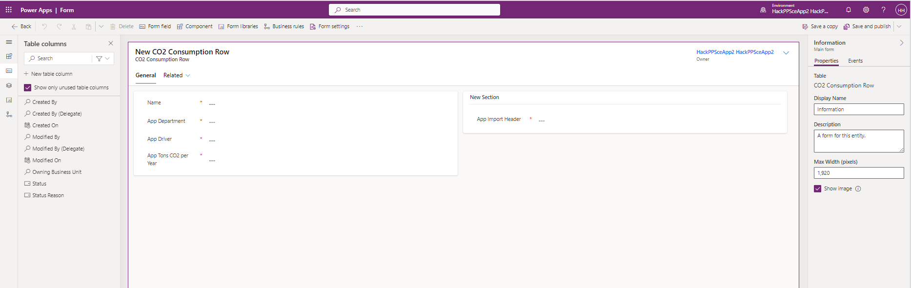 
 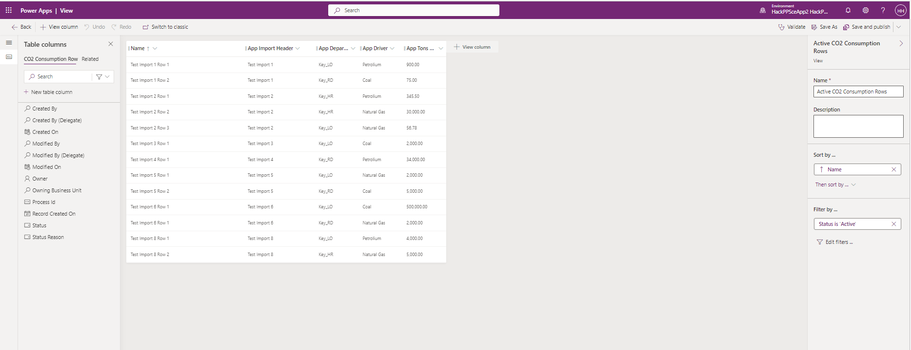 
The main task was to add our newly craeted business related columns (= attributes) to the Forms and Views that the Dataverse had created automatically.

You can also see that the Dataverse has already created multiple Forms (or similarly multiple Views) for a table, these different Forms (or Views) mainly differ in the filter settings that are used for the Form (or View).

## Advantages and Disadvantages
The advatages and disadvantages by using this Datverse driven apporach for creating the UI are pretty obvious: while using the Dataverse provided Forms and Views you can craete the UI faster compared to composing masks from widgets. On the other hand, this apporach is much more rigid and might not allow you to implement use cases as the users would like them.

# 3. Using a Business Process Flow to glue together the Dataverse Based UI

## Approach
In the previous chapter we constructed the masks of the UI, but now we want to bring it all together to construct UI flows for the specified use cases. To do this the Power Platform has two different mechanisms:
- the standard UI that the Power Platform automatically generates for your app based on the included tables
- workflows that is called Business Process Flows that lets you glue together different masks according to a given business logic.

## The standard UI that the Power Platform automatically generates
The standard has two parts a menu on the left side:
 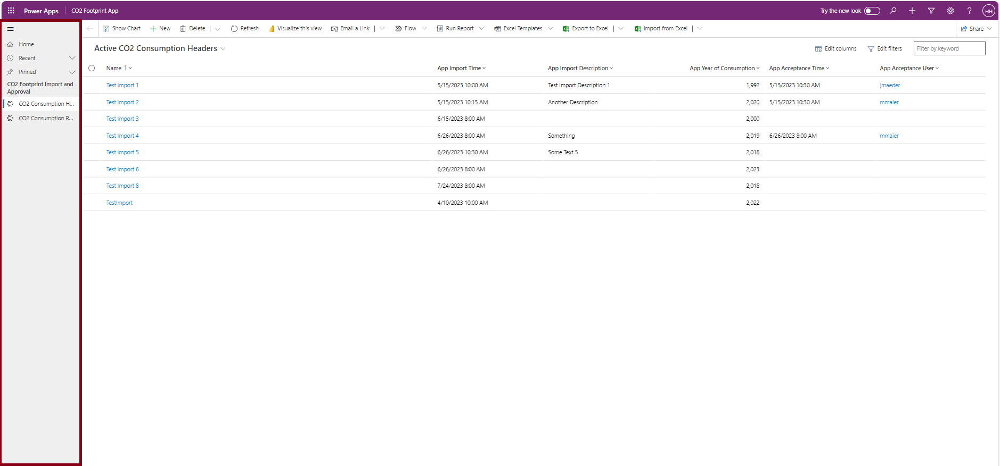 
and some button for functions at the top of the app:
 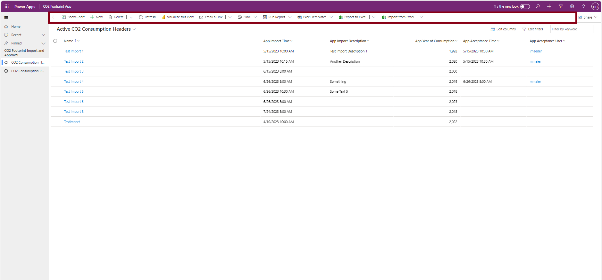 
With these UI elements you can naviagate to the business related table view their content and create, edit and delete rows in those tables.

## Business Process Flow
In our example we only created one Business Process Flow that guides the user through the data insert use case of the scenario. This Business Process Flow can be found in the App editor under "Automation":
 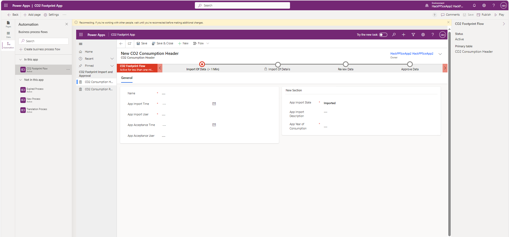 
If we open the editor for the Business Process Flow
 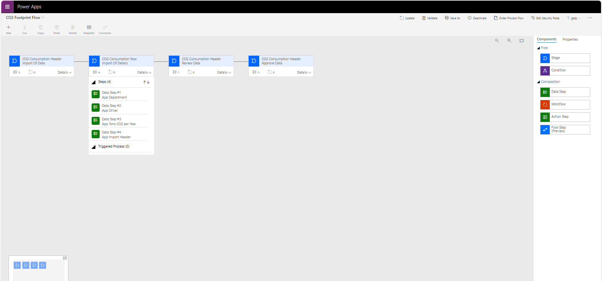 
we can see it's elements. The different elements that can be used in a Business Process Flow can be seen on the right side. The main logic elements are phases and conditions. In our case we did not need any condition logic. Each Pahse just has Data Steps for inserting data. This means that the Business Process Flow is a sequence of Phases and in each Phase you just insert or change some of the necessary data.
Note: Business Process Flows can now be found in the "Automation" section in the App editor. Before they had to be created as independent objects outside of the app in the Power Platform menu.

## Advantages and Disadvantages
Comparing the automation in the standard Hackathon approach and this new approach is difficult because the automation happens on different business and technical levels. Overall the way to construct the flows was pretty similar in both approaches, the only noteworthy difference was that while modelling the Business Process Flow we did not have to deal with some strange requirements like inserting a null value into a mandatory field that actually contains autogenerated values (which was a necessary but hard to figure out way to model the flow in the standard approach).

# 4. Running the App
Starting the app takes the user to the start page
 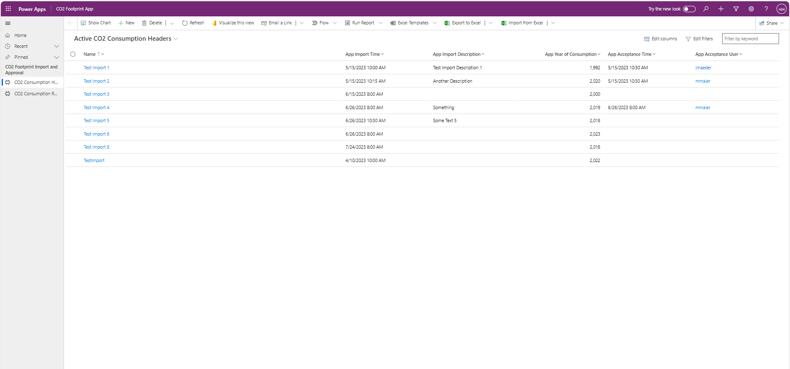 
which shows the all imports from the past, the menu on the left side and the available functions at the top of the app screen.

We can start a new import by clicking the "+ New" button on the top. With this we start a new import process which is a Business Process Flow.
 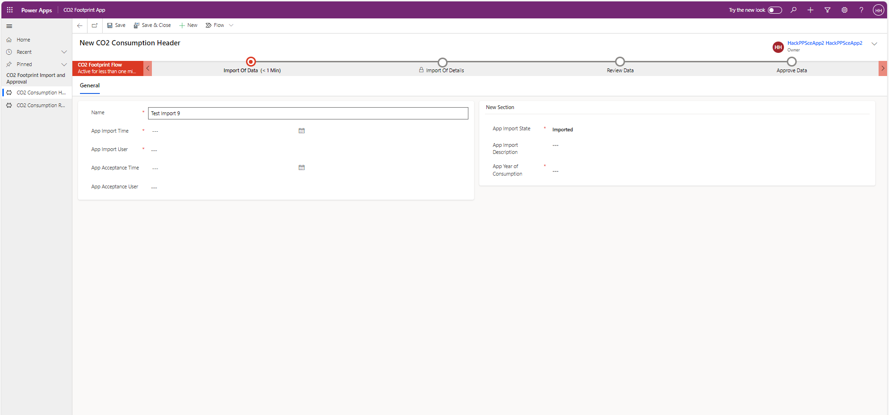 
First, we must enter the data for the new header entry which represents the new import entry.

Alternatively we can enter the necessary data in the small popup window for the first step of this Business Process Flow. 
 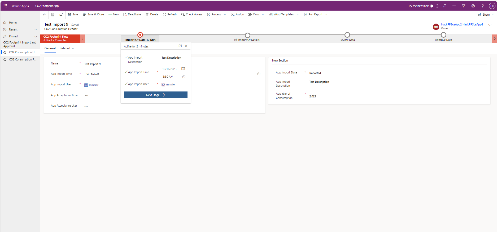 
This popup just asks for the necessary fields to be filled and omits the fields that are used in later stages of the import.

If we continue to the next stage in the Business Process Flow a new import row entry is created and we mustt enter the mandatory dat for it.
 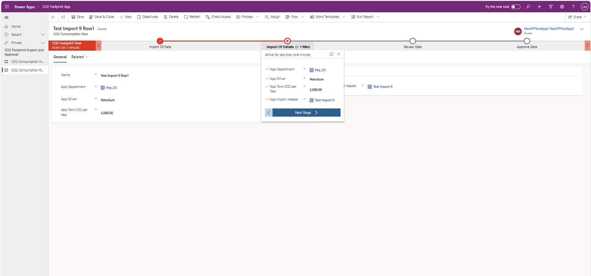 
We can add more import rows by using the "+ New" button on top of the app again.

Continuing with the Business Process Flow we get to the next step which is a review of the data.
 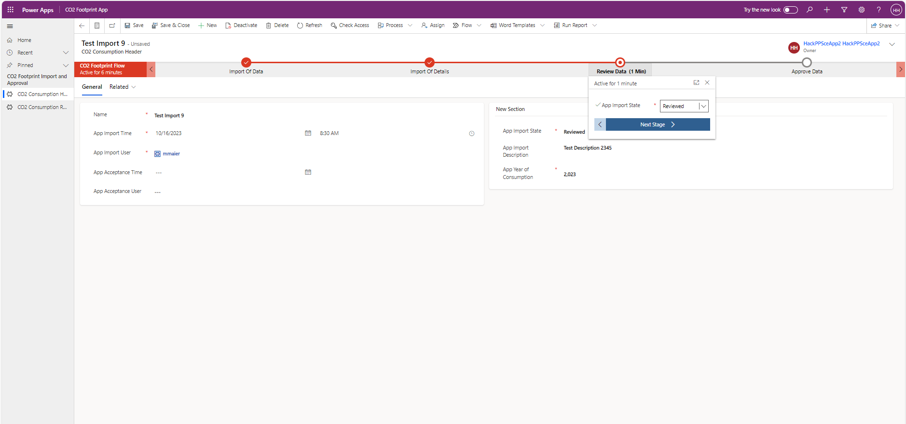 
The result of the review is just a change in the stateof the header entry.

The final step is just the acceptance of the newly created import by again changing the state and adding some additonal data like acceptance user and acceptance date and time.
 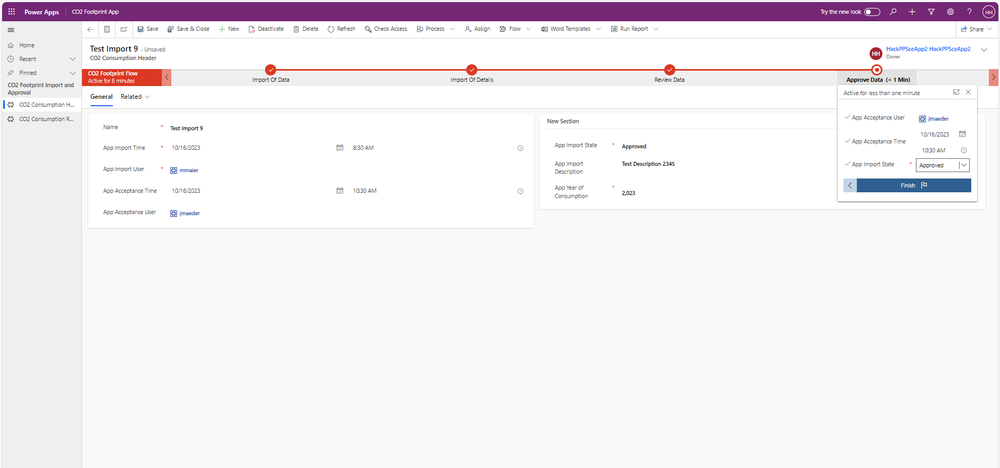 
After that the Business Process Flow is finished.